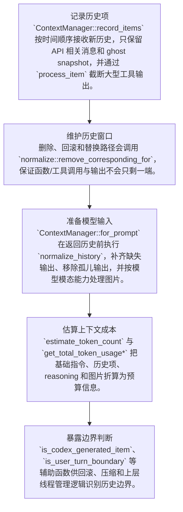

# history 代码架构文档

## 执行摘要

`history.rs` 所在目录主要负责Codex 对话历史的记录、裁剪、归一化、模型可见内容构造，以及 token 使用量估算。本次分析覆盖 5 个 rust 文件（history.rs、history_tests.rs、mod.rs、normalize.rs、updates.rs），核心阅读对象包括 ContextManager、ContextManager::record_items、ContextManager::for_prompt、ContextManager::raw_items。

入口文件：[codex/codex-rs/core/src/context_manager/history.rs](/codex/codex-rs/core/src/context_manager/history.rs#L1)  
目标目录：`/codex/codex-rs/core/src/context_manager`  
涉及语言：rust

## 功能定位与业务说明

`ContextManager` 是历史状态门面：它持有按时间排序的 `ResponseItem`、token 统计和参考上下文快照，并负责把原始历史整理成可发送给模型的 prompt 历史。

`normalize` 模块维护历史协议不变量：工具调用必须有输出、输出必须能找到调用；当模型不支持图片时，图片内容会被替换为占位文本而不是破坏消息结构。

`updates` 模块按固定顺序生成上下文差量更新，优先注入模型切换指令，再处理环境、权限、协作模式和 personality 变化。

建议阅读顺序：先看 ContextManager、ContextManager::record_items、ContextManager::for_prompt、ContextManager::raw_items、ContextManager::estimate_token_count，再沿职责表中的源码链接跳到具体实现。

### 关键业务概念

- **历史项 / ResponseItem**：一次对话中模型、用户、工具调用和工具输出的结构化记录；发送给模型前必须保持顺序和协议不变量。
- **Token 预算**：结合服务端 usage 与本地启发式估算，判断历史是否接近模型上下文窗口。
- **输入模态降级**：当模型不支持图片等输入类型时，用占位文本保留历史位置，同时避免发送不可处理内容。
- **上下文差量更新**：比较上一轮和下一轮运行上下文，只把变化部分作为开发者指令重新注入模型历史。
- **上下文**：可以理解为流程运行时共享的一组背景信息，例如当前配置、会话状态、依赖对象或已收集的数据。

## 关键结构与职责表

| 名称 | 类型 | 源码位置 | 职责说明 | 阅读要点 |
| --- | --- | --- | --- | --- |
| `ContextManager` | 结构体 | [history.rs:26](/codex/codex-rs/core/src/context_manager/history.rs#L26) | 维护按时间排序的模型交互历史、token 使用统计和上下文基线，是发送模型前整理 prompt 历史的核心状态对象。 | 抽象层较多，建议先看接口，再看具体实现。 |
| `ContextManager::record_items` | 方法 | [history.rs:84](/codex/codex-rs/core/src/context_manager/history.rs#L84) | 接收按时间顺序到来的历史项，只保留 API 相关项和 ghost snapshot，并在入库前按截断策略压缩工具输出。 | 先确认它会改动哪些状态：`items`。 |
| `ContextManager::for_prompt` | 方法 | [history.rs:105](/codex/codex-rs/core/src/context_manager/history.rs#L105) | 生成即将发送给模型的历史列表：先执行历史归一化，再移除 ghost snapshot，最终返回模型可见的 `ResponseItem` 序列。 | 先确认它依赖哪些状态：`items`。 |
| `ContextManager::raw_items` | 方法 | [history.rs:113](/codex/codex-rs/core/src/context_manager/history.rs#L113) | 提供未归一化的历史只读视图，供调用方检查当前内存中的原始 `ResponseItem`。 | 这是轻量访问器，重点看 `items` 的来源以及谁依赖这个读取结果。 |
| `ContextManager::estimate_token_count` | 方法 | [history.rs:119](/codex/codex-rs/core/src/context_manager/history.rs#L119) | 结合当前回合的模型基础指令与历史项估算 token 总量，用于上下文窗口预算判断。 | 包含错误边界或风险点，建议先看出错路径；再顺着 `estimate_token_count_with_base_instructions` 看异常如何传播。 |
| `strip_images_when_unsupported` | 函数 | [normalize.rs:223](/codex/codex-rs/core/src/context_manager/normalize.rs#L223) | 当模型不支持图片输入时，把消息和工具输出中的图片内容替换为固定占位文本，同时保留历史结构。 | 先抓输入、输出与状态变化，再决定是否需要展开相邻调用点。 |
| `TotalTokenUsageBreakdown` | 结构体 | [history.rs:42](/codex/codex-rs/core/src/context_manager/history.rs#L42) | 承载 token 统计拆解结果，把服务端已报告 token、历史可见字节数和最近新增项的估算成本分开暴露，方便上层做预算判断。 | 先抓输入、输出与状态变化，再决定是否需要展开相邻调用点。 |
| `ContextManager::set_reference_context_item` | 方法 | [history.rs:66](/codex/codex-rs/core/src/context_manager/history.rs#L66) | 更新 `reference_context_item` 状态字段，是 `ContextManager` 对外暴露的显式状态写入入口。 | 抽象层较多，建议先看接口，再看具体实现。 |
| `ContextManager::reference_context_item` | 方法 | [history.rs:70](/codex/codex-rs/core/src/context_manager/history.rs#L70) | 读取 `reference_context_item` 相关状态，避免调用方直接访问 `ContextManager` 的内部字段。 | 抽象层较多，建议先看接口，再看具体实现。 |
| `ContextManager::new` | 方法 | [history.rs:50](/codex/codex-rs/core/src/context_manager/history.rs#L50) | 构造并返回一个可直接投入后续流程使用的初始对象。 | 先抓输入、输出与状态变化，再决定是否需要展开相邻调用点。 |
| `ContextManager::token_info` | 方法 | [history.rs:58](/codex/codex-rs/core/src/context_manager/history.rs#L58) | 读取 `token_info` 相关状态，避免调用方直接访问 `ContextManager` 的内部字段。 | 抽象层较多，建议先看接口，再看具体实现。 |
| `ContextManager::set_token_info` | 方法 | [history.rs:62](/codex/codex-rs/core/src/context_manager/history.rs#L62) | 更新 `token_info` 状态字段，是 `ContextManager` 对外暴露的显式状态写入入口。 | 抽象层较多，建议先看接口，再看具体实现。 |
| `ContextManager::set_token_usage_full` | 方法 | [history.rs:74](/codex/codex-rs/core/src/context_manager/history.rs#L74) | 更新 `token_usage_full` 状态字段，是 `ContextManager` 对外暴露的显式状态写入入口。 | 这是直接状态写入点，重点看 `token_info` 在哪些回合边界被更新。 |
| `ContextManager::estimate_token_count_with_base_instructions` | 方法 | [history.rs:128](/codex/codex-rs/core/src/context_manager/history.rs#L128) | 把基础指令 token 与每个历史项的估算 token 饱和相加，形成粗粒度预算结果。 | 先抓输入、输出与状态变化，再决定是否需要展开相邻调用点。 |
| `ContextManager::remove_first_item` | 方法 | [history.rs:144](/codex/codex-rs/core/src/context_manager/history.rs#L144) | 删除最老历史项，并同步删除与其配对的调用或输出，避免破坏工具调用配对不变量。 | 先确认它会改动哪些状态：`items`。 |
| `ensure_call_outputs_present` | 函数 | [normalize.rs:16](/codex/codex-rs/core/src/context_manager/normalize.rs#L16) | 扫描历史中的函数、自定义工具和本地 shell 调用，确保每个调用都有对应输出占位，维持 OpenAI 输入协议不变量。 | 包含错误边界或风险点，建议先看出错路径。 |
| `personality_message_for` | 函数 | [updates.rs:92](/codex/codex-rs/core/src/context_manager/updates.rs#L92) | 从模型消息配置中查找指定 personality 的指令文本，并过滤空消息。 | 先抓输入、输出与状态变化，再决定是否需要展开相邻调用点。 |
| `build_model_instructions_update_item` | 函数 | [updates.rs:103](/codex/codex-rs/core/src/context_manager/updates.rs#L103) | 模型发生切换时生成新的模型指令注入项，确保下一个模型收到匹配的基础行为说明。 | 先抓输入、输出与状态变化，再决定是否需要展开相邻调用点。 |
| `remove_orphan_outputs` | 函数 | [normalize.rs:104](/codex/codex-rs/core/src/context_manager/normalize.rs#L104) | 删除找不到对应调用项的输出，并在发现孤儿输出时记录错误或触发测试期 panic。 | 包含错误边界或风险点，建议先看出错路径。 |
| `build_settings_update_items` | 函数 | [updates.rs:120](/codex/codex-rs/core/src/context_manager/updates.rs#L120) | 比较上一轮和下一轮上下文，按固定顺序生成模型指令、环境、权限、协作模式和人格等差量更新项。 | 再顺着调用链继续看：`build_collaboration_mode_update_item`、`build_environment_update_item`、`build_model_instructions_update_item`。 |

## 主流程

1. **记录历史项**：`ContextManager::record_items` 按时间顺序接收新历史，只保留 API 相关消息和 ghost snapshot，并通过 `process_item` 截断大型工具输出。
2. **维护历史窗口**：删除、回滚和替换路径会调用 `normalize::remove_corresponding_for`，保证函数/工具调用与输出不会只剩一端。
3. **准备模型输入**：`ContextManager::for_prompt` 在返回历史前执行 `normalize_history`，补齐缺失输出、移除孤儿输出，并按模型模态能力处理图片。
4. **估算上下文成本**：`estimate_token_count` 与 `get_total_token_usage*` 把基础指令、历史项、reasoning 和图片折算为预算信息。
5. **暴露边界判断**：`is_codex_generated_item`、`is_user_turn_boundary` 等辅助函数供回滚、压缩和上层线程管理逻辑识别历史边界。



### 模块关系

- [history.rs](/codex/codex-rs/core/src/context_manager/history.rs#L1) → [normalize.rs](/codex/codex-rs/core/src/context_manager/normalize.rs#L1)
- [mod.rs](/codex/codex-rs/core/src/context_manager/mod.rs#L1) → [history.rs](/codex/codex-rs/core/src/context_manager/history.rs#L1)
- [mod.rs](/codex/codex-rs/core/src/context_manager/mod.rs#L1) → [normalize.rs](/codex/codex-rs/core/src/context_manager/normalize.rs#L1)
- [mod.rs](/codex/codex-rs/core/src/context_manager/mod.rs#L1) → [updates.rs](/codex/codex-rs/core/src/context_manager/updates.rs#L1)
- [mod.rs](/codex/codex-rs/core/src/context_manager/mod.rs#L1) → [history_tests.rs](/codex/codex-rs/core/src/context_manager/history_tests.rs#L1)

## 难点类比解释

**历史项配对不变量**

这类代码通常要求“调用项”和“输出项”成对存在，否则模型侧会看到不完整的工具调用历史。

类比理解：优先检查插入、删除和回滚路径是否同时维护两端，而不是只看单个 Vec 的增删。

**Token 预算是启发式估算**

上下文预算往往结合服务端真实 usage、客户端新增项和字节到 token 的近似换算。

类比理解：阅读时要区分“服务端已统计的 token”和“本地为了决策临时估算的 token”。

**多模态能力降级**

当目标模型不支持某类输入时，历史仍要保持结构完整，但对应内容需要替换或省略。

类比理解：重点确认替换后是否仍保留用户/工具输出的语义位置，以及是否避免把不可用内容发给模型。

**上下文差量更新**

上下文更新代码通常只在 previous 与 next 存在差异时生成新指令，避免重复注入相同信息。

类比理解：阅读时要沿着每个 early return 看清楚：哪些变化会发给模型，哪些变化会被静默跳过。

**并发/异步流程**

代码可能不是按单线程直线往下跑，而是把等待 I/O 或耗时操作拆出去并行推进。

类比理解：阅读时先区分发起者、等待点和结果汇总点，再回头看错误传播路径。

## 示例代码片段

### `ContextManager`

位置：[codex/codex-rs/core/src/context_manager/history.rs:26](/codex/codex-rs/core/src/context_manager/history.rs#L26)

```rust
pub(crate) struct ContextManager {
    /// The oldest items are at the beginning of the vector.
    items: Vec<ResponseItem>,
    token_info: Option<TokenUsageInfo>,
    /// Reference context snapshot used for diffing and producing model-visible
    /// settings update items.
    ///
    /// This is the baseline for the next regular model turn, and may already
    /// match the current turn after context updates are persisted.
    ///
    /// When this is `None`, settings diffing treats the next turn as having no
    /// baseline and emits a full reinjection of context state.
    reference_context_item: Option<TurnContextItem>,
}
```

### `ContextManager::record_items`

位置：[codex/codex-rs/core/src/context_manager/history.rs:84](/codex/codex-rs/core/src/context_manager/history.rs#L84)

```rust
    pub(crate) fn record_items<I>(&mut self, items: I, policy: TruncationPolicy)
    where
        I: IntoIterator,
        I::Item: std::ops::Deref<Target = ResponseItem>,
    {
        for item in items {
            let item_ref = item.deref();
            let is_ghost_snapshot = matches!(item_ref, ResponseItem::GhostSnapshot { .. });
            if !is_api_message(item_ref) && !is_ghost_snapshot {
                continue;
            }

            let processed = self.process_item(item_ref, policy);
            self.items.push(processed);
        }
    }
```

### `ContextManager::for_prompt`

位置：[codex/codex-rs/core/src/context_manager/history.rs:105](/codex/codex-rs/core/src/context_manager/history.rs#L105)

```rust
    pub(crate) fn for_prompt(mut self, input_modalities: &[InputModality]) -> Vec<ResponseItem> {
        self.normalize_history(input_modalities);
        self.items
            .retain(|item| !matches!(item, ResponseItem::GhostSnapshot { .. }));
        self.items
    }

    /// Returns raw items in the history.
    pub(crate) fn raw_items(&self) -> &[ResponseItem] {
        &self.items
```

## 生成信息

- 生成时间：2026-05-14T10:05:27+08:00
- 分析文件数：5
- 文件清单：[history.rs](/codex/codex-rs/core/src/context_manager/history.rs#L1)、[history_tests.rs](/codex/codex-rs/core/src/context_manager/history_tests.rs#L1)、[mod.rs](/codex/codex-rs/core/src/context_manager/mod.rs#L1)、[normalize.rs](/codex/codex-rs/core/src/context_manager/normalize.rs#L1)、[updates.rs](/codex/codex-rs/core/src/context_manager/updates.rs#L1)
