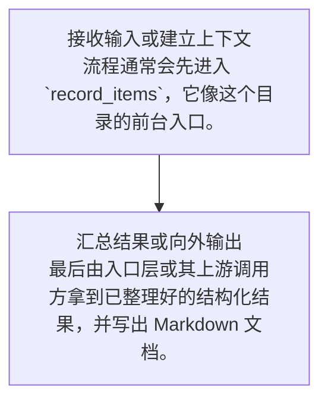

# history 代码架构文档

## 执行摘要

该实现会以 history.rs 为入口，递归分析其所在目录内的源码文件，优先通过抽象语法树提取核心结构，再结合注释、命名、导入关系和局部调用链生成面向初学者的 Markdown 架构说明。 本次分析覆盖的源码语言包括 rust，输出会自动落在目标目录，并附带执行摘要、关键结构表、主流程 mermaid 图、难点类比说明和代表性代码片段。

入口文件：`/config/workspace/codex/codex-rs/core/src/context_manager/history.rs`  
目标目录：`/config/workspace/codex/codex-rs/core/src/context_manager`  
涉及语言：rust

## 功能定位与业务说明

从当前代码特征看，这个目录的关注点主要围绕：codex、the、code、openai、when、cli。

最值得先读的对象通常是：ContextManager、record_items、for_prompt、raw_items。

生成策略会优先相信显式注释和类型声明，其次才根据命名和调用关系做推断，以降低“看名字猜功能”带来的误判。

如果遇到当前未支持的语言扩展名，工具会立即给出明确报错，不会静默跳过入口文件。

### 关键业务概念

- **上下文**：可以理解为流程运行时共享的一组背景信息，例如当前配置、会话状态、依赖对象或已收集的数据。
- **语法树**：先把源代码解析成树状结构，再去理解“谁定义了什么、谁调用了谁”。

## 关键结构与职责表

| 名称 | 类型 | 所在文件 | 角色说明 | 初学者阅读提示 |
| --- | --- | --- | --- | --- |
| ContextManager | 结构体 | history.rs:26 | 承担总控与协调职责，像一个总调度台。 | 抽象层较多，建议先看接口，再看具体实现。 |
| record_items | 函数 | history.rs:84 | 更像流程中的一个动作节点，负责完成某一步操作。 | 整体不算绕，但第一次读时最好先抓输入、输出和状态变化。 |
| for_prompt | 函数 | history.rs:105 | 更像流程中的一个动作节点，负责完成某一步操作。 | 整体不算绕，但第一次读时最好先抓输入、输出和状态变化。 |
| raw_items | 函数 | history.rs:113 | 更像流程中的一个动作节点，负责完成某一步操作。 | 整体不算绕，但第一次读时最好先抓输入、输出和状态变化。 |
| estimate_token_count | 函数 | history.rs:119 | 更像流程中的一个动作节点，负责完成某一步操作。 | 包含错误边界或风险点，建议先看出错路径。 |
| strip_images_when_unsupported | 函数 | normalize.rs:223 | 更像流程中的一个动作节点，负责完成某一步操作。 | 整体不算绕，但第一次读时最好先抓输入、输出和状态变化。 |
| TotalTokenUsageBreakdown | 结构体 | history.rs:42 | 更像承载核心状态与行为边界的主体对象。 | 整体不算绕，但第一次读时最好先抓输入、输出和状态变化。 |
| set_reference_context_item | 函数 | history.rs:66 | 负责维护上下文或运行现场，像工作台上的共享白板。 | 抽象层较多，建议先看接口，再看具体实现。 |
| reference_context_item | 函数 | history.rs:70 | 负责维护上下文或运行现场，像工作台上的共享白板。 | 抽象层较多，建议先看接口，再看具体实现。 |
| new | 函数 | history.rs:50 | 更像流程中的一个动作节点，负责完成某一步操作。 | 整体不算绕，但第一次读时最好先抓输入、输出和状态变化。 |
| token_info | 函数 | history.rs:58 | 更像流程中的一个动作节点，负责完成某一步操作。 | 抽象层较多，建议先看接口，再看具体实现。 |
| set_token_info | 函数 | history.rs:62 | 更像流程中的一个动作节点，负责完成某一步操作。 | 抽象层较多，建议先看接口，再看具体实现。 |
| set_token_usage_full | 函数 | history.rs:74 | 更像流程中的一个动作节点，负责完成某一步操作。 | 整体不算绕，但第一次读时最好先抓输入、输出和状态变化。 |
| estimate_token_count_with_base_instructions | 函数 | history.rs:128 | 更像流程中的一个动作节点，负责完成某一步操作。 | 整体不算绕，但第一次读时最好先抓输入、输出和状态变化。 |
| remove_first_item | 函数 | history.rs:144 | 更像流程中的一个动作节点，负责完成某一步操作。 | 整体不算绕，但第一次读时最好先抓输入、输出和状态变化。 |
| ensure_call_outputs_present | 函数 | normalize.rs:16 | 更像流程中的一个动作节点，负责完成某一步操作。 | 包含错误边界或风险点，建议先看出错路径。 |
| personality_message_for | 函数 | updates.rs:92 | 更像流程中的一个动作节点，负责完成某一步操作。 | 整体不算绕，但第一次读时最好先抓输入、输出和状态变化。 |
| build_model_instructions_update_item | 函数 | updates.rs:103 | 更像流程中的一个动作节点，负责完成某一步操作。 | 整体不算绕，但第一次读时最好先抓输入、输出和状态变化。 |
| remove_orphan_outputs | 函数 | normalize.rs:104 | 更像流程中的一个动作节点，负责完成某一步操作。 | 包含错误边界或风险点，建议先看出错路径。 |
| build_settings_update_items | 函数 | updates.rs:120 | 更像流程中的一个动作节点，负责完成某一步操作。 | 整体不算绕，但第一次读时最好先抓输入、输出和状态变化。 |

## 主流程

1. **接收输入或建立上下文**：流程通常会先进入 `record_items`，它像这个目录的前台入口。
2. **汇总结果或向外输出**：最后由入口层或其上游调用方拿到已整理好的结构化结果，并写出 Markdown 文档。



### 模块关系

- `history.rs` → `normalize.rs`
- `mod.rs` → `history.rs`
- `mod.rs` → `normalize.rs`
- `mod.rs` → `updates.rs`
- `mod.rs` → `history_tests.rs`

## 难点类比解释

**并发/异步流程**

代码可能不是按单线程直线往下跑，而是把等待 I/O 或耗时操作拆出去并行推进。

类比理解：可以把它想成餐厅里同时处理点单、后厨出餐、叫号取餐，顾客看到的是一个流程，内部其实是多个环节协同。

**缓存与复用**

这类代码会优先复用已算过的数据，以减少重复昂贵操作。

类比理解：就像图书馆先查索引卡片，找到馆藏位置再取书，而不是每次都从头翻遍整馆。

**抽象层与泛型**

代码强调“约定优先”，先定义一套接口或能力，再让不同实现去接入。

类比理解：可以把它理解成插座标准：先规定插头接口，具体接电风扇还是电饭煲并不重要。

**状态流转**

逻辑不是一次完成，而是在多个状态之间逐步推进，每一步可走的分支不同。

类比理解：像订单从“待支付、待发货、运输中、已签收”逐步流转，每个阶段允许的动作都不同。

**上下文传递**

部分信息不会直接写死在函数里，而是通过上下文对象逐层传递。

类比理解：像会议中共享的白板，后续所有参与者都从这块白板读取当前背景信息。

## 示例代码片段

### `ContextManager`

位置：`history.rs:26`

```rust
pub(crate) struct ContextManager {
    /// The oldest items are at the beginning of the vector.
    items: Vec<ResponseItem>,
    token_info: Option<TokenUsageInfo>,
    /// Reference context snapshot used for diffing and producing model-visible
    /// settings update items.
    ///
    /// This is the baseline for the next regular model turn, and may already
    /// match the current turn after context updates are persisted.
    ///
    /// When this is `None`, settings diffing treats the next turn as having no
    /// baseline and emits a full reinjection of context state.
    reference_context_item: Option<TurnContextItem>,
}
```

### `record_items`

位置：`history.rs:84`

```rust
    pub(crate) fn record_items<I>(&mut self, items: I, policy: TruncationPolicy)
    where
        I: IntoIterator,
        I::Item: std::ops::Deref<Target = ResponseItem>,
    {
        for item in items {
            let item_ref = item.deref();
            let is_ghost_snapshot = matches!(item_ref, ResponseItem::GhostSnapshot { .. });
            if !is_api_message(item_ref) && !is_ghost_snapshot {
                continue;
            }

            let processed = self.process_item(item_ref, policy);
            self.items.push(processed);
        }
    }
```

### `for_prompt`

位置：`history.rs:105`

```rust
    pub(crate) fn for_prompt(mut self, input_modalities: &[InputModality]) -> Vec<ResponseItem> {
        self.normalize_history(input_modalities);
        self.items
            .retain(|item| !matches!(item, ResponseItem::GhostSnapshot { .. }));
        self.items
    }

    /// Returns raw items in the history.
    pub(crate) fn raw_items(&self) -> &[ResponseItem] {
        &self.items
```

## 生成信息

- 生成时间：2026-05-13T16:00:49+08:00
- 分析文件数：5
- 文件清单：history.rs、history_tests.rs、mod.rs、normalize.rs、updates.rs
