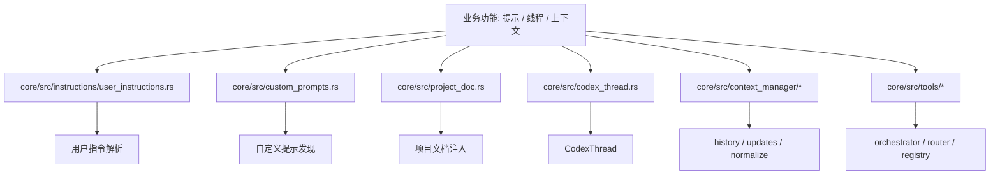
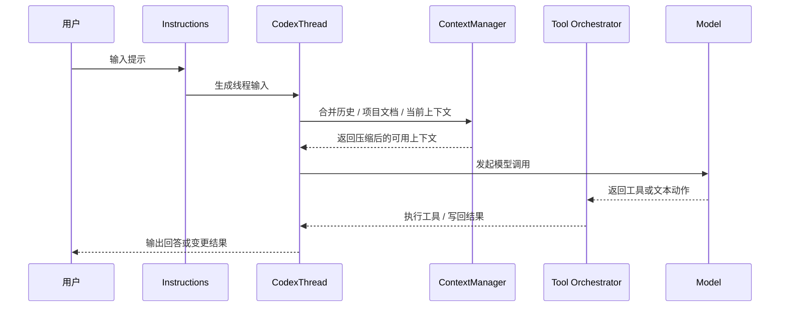

# 第05章 提示

> 原始页面：[Prompting – Codex | OpenAI Developers](https://developers.openai.com/codex/prompting)

这一章讲怎样和 Codex 对话。表面上是在写提示词，实际上是在给代理规定目标、约束和验收标准。

这部分看起来简单，但它决定了后面几乎所有任务的质量。

## 数学类比
把提示词想成做几何证明时的题目条件。条件越完整，证明路径越短；条件越含糊，辅助线就会乱加。

## 严谨定义
严格地说，提示是对目标函数、约束条件和验证标准的联合描述。

## 本章先抓重点
- `提示`：你通过发送提示（用户消息）与 Codex 互动，这些提示描述你希望它做什么。
- `线程`：线程是一个单一会话：你的提示加上随后模型输出和工具调用。一个线程可以包含多个提示。例如，你的第一个提示可能要求 Codex 实现一个功能，而后续提示可能要求它添加测试。
- `上下文`：当你提交一个提示时，包含 Codex 可以使用的上下文，例如对相关文件和图像的引用。Codex IDE 扩展自动包括打开文件的列表和选定文本范围作为上下文。

## 正文整理
### 提示
你通过发送提示（用户消息）与 Codex 互动，这些提示描述你希望它做什么。（实现：[custom_prompts](/config/workspace/codex/codex-rs/core/src/custom_prompts.rs:9)、[project_doc](/config/workspace/codex/codex-rs/core/src/project_doc.rs:134)、[instructions/user_instructions](/config/workspace/codex/codex-rs/core/src/instructions/user_instructions.rs:1)）

继续往下看，这一节还强调了两件事：
- 示例提示：（实现：[custom_prompts](/config/workspace/codex/codex-rs/core/src/custom_prompts.rs:9)、[project_doc](/config/workspace/codex/codex-rs/core/src/project_doc.rs:134)、[instructions/user_instructions](/config/workspace/codex/codex-rs/core/src/instructions/user_instructions.rs:1)）
- 当你提交一个提示时，Codex 在一个循环中工作：它调用模型，然后执行模型输出所指示的操作，例如文件读取、文件编辑和工具调用。此过程在任务完成或你取消它时结束。（实现：[tools/orchestrator](/config/workspace/codex/codex-rs/core/src/tools/orchestrator.rs:43)、[tools/router](/config/workspace/codex/codex-rs/core/src/tools/router.rs:1)、[tools/registry](/config/workspace/codex/codex-rs/core/src/tools/registry.rs:1)、[unified_exec/mod](/config/workspace/codex/codex-rs/core/src/unified_exec/mod.rs:74)）
- 与 ChatGPT 一样，Codex 的有效性取决于你给它的指令。以下是一些我们在提示 Codex 时发现的有用提示：（实现：[custom_prompts](/config/workspace/codex/codex-rs/core/src/custom_prompts.rs:9)、[project_doc](/config/workspace/codex/codex-rs/core/src/project_doc.rs:134)、[instructions/user_instructions](/config/workspace/codex/codex-rs/core/src/instructions/user_instructions.rs:1)）

### 线程
线程是一个单一会话：你的提示加上随后模型输出和工具调用。一个线程可以包含多个提示。例如，你的第一个提示可能要求 Codex 实现一个功能，而后续提示可能要求它添加测试。（实现：[CodexThread](/config/workspace/codex/codex-rs/core/src/codex_thread.rs:37)、[ThreadManager](/config/workspace/codex/codex-rs/core/src/thread_manager.rs:120)、[context_manager](/config/workspace/codex/codex-rs/core/src/context_manager/mod.rs:1)、[message_history](/config/workspace/codex/codex-rs/core/src/message_history.rs:1)）

继续往下看，这一节还强调了两件事：
- 当 Codex 正在积极处理时，线程被称为“运行中”。你可以同时运行多个线程，但应避免让两个线程修改同一文件。你也可以稍后通过另一个提示继续运行一个线程。（实现：[CodexThread](/config/workspace/codex/codex-rs/core/src/codex_thread.rs:37)、[ThreadManager](/config/workspace/codex/codex-rs/core/src/thread_manager.rs:120)、[context_manager](/config/workspace/codex/codex-rs/core/src/context_manager/mod.rs:1)、[message_history](/config/workspace/codex/codex-rs/core/src/message_history.rs:1)）
- 线程可以在本地或云中运行：（实现：[CodexThread](/config/workspace/codex/codex-rs/core/src/codex_thread.rs:37)、[ThreadManager](/config/workspace/codex/codex-rs/core/src/thread_manager.rs:120)、[context_manager](/config/workspace/codex/codex-rs/core/src/context_manager/mod.rs:1)、[message_history](/config/workspace/codex/codex-rs/core/src/message_history.rs:1)）
- **本地线程** 在你的机器上运行。Codex 可以读取和编辑你的文件并运行命令，因此你可以看到所做的更改并使用你现有的工具。为了降低在工作区之外意外更改的风险，本地线程在 沙箱 中运行。（实现：[CodexThread](/config/workspace/codex/codex-rs/core/src/codex_thread.rs:37)、[ThreadManager](/config/workspace/codex/codex-rs/core/src/thread_manager.rs:120)、[context_manager](/config/workspace/codex/codex-rs/core/src/context_manager/mod.rs:1)、[message_history](/config/workspace/codex/codex-rs/core/src/message_history.rs:1)）

### 上下文
当你提交一个提示时，包含 Codex 可以使用的上下文，例如对相关文件和图像的引用。Codex IDE 扩展自动包括打开文件的列表和选定文本范围作为上下文。（实现：[CodexThread](/config/workspace/codex/codex-rs/core/src/codex_thread.rs:37)、[ThreadManager](/config/workspace/codex/codex-rs/core/src/thread_manager.rs:120)、[context_manager](/config/workspace/codex/codex-rs/core/src/context_manager/mod.rs:1)、[message_history](/config/workspace/codex/codex-rs/core/src/message_history.rs:1)）

继续往下看，这一节还强调了两件事：
- 当代理工作时，它还会从文件内容、工具输出和它所做的事情及仍需做的事情的持续记录中收集上下文。（实现：[CodexThread](/config/workspace/codex/codex-rs/core/src/codex_thread.rs:37)、[ThreadManager](/config/workspace/codex/codex-rs/core/src/thread_manager.rs:120)、[context_manager](/config/workspace/codex/codex-rs/core/src/context_manager/mod.rs:1)、[message_history](/config/workspace/codex/codex-rs/core/src/message_history.rs:1)）
- 线程中的所有信息必须适合模型的 **上下文窗口**，这个窗口因模型而异。Codex 会监控并报告剩余空间。对于较长的任务，Codex 可能会通过总结相关信息并丢弃不相关的细节来自动 **压缩** 上下文。通过重复压缩，Codex 可以在多个步骤中继续处理复杂任务。（实现：[CodexThread](/config/workspace/codex/codex-rs/core/src/codex_thread.rs:37)、[ThreadManager](/config/workspace/codex/codex-rs/core/src/thread_manager.rs:120)、[context_manager](/config/workspace/codex/codex-rs/core/src/context_manager/mod.rs:1)、[message_history](/config/workspace/codex/codex-rs/core/src/message_history.rs:1)）

## 代码结构图
提示功能在代码里的核心结构，是“指令输入层 + 线程上下文层 + 工具编排层”三层叠在一起。

## 实现流程图
这张图对应“用户发出一条提示后，Codex 如何把它变成一次带上下文、可调用工具的执行回合”。

## 小结
读完这一章后，最重要的不是记住页面上的每个术语，而是知道它在整个 Codex 体系里负责解决什么问题。
