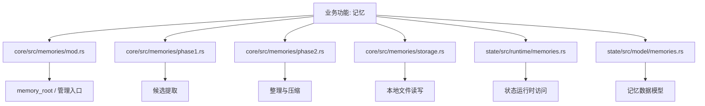
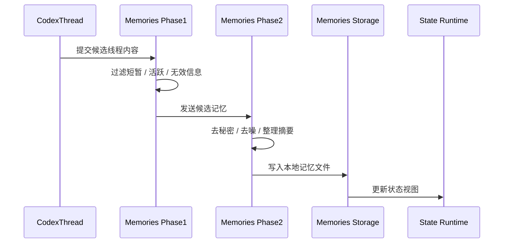

# 第07章 记忆

> 原始页面：[Memories – Codex | OpenAI Developers](https://developers.openai.com/codex/memories)

这一章讲记忆，也就是 Codex 如何在多次任务之间保留对你有帮助的信息。

这部分容易和线程上下文混淆，读的时候要注意区分“当前对话中的信息”和“跨任务保留的信息”。

## 数学类比
线程像解一道多步函数题时保留下来的草稿纸。后一步是否顺利，依赖前面保留下来的中间结果。

## 严谨定义
严格地说，线程是一个按时间顺序累积状态的信息序列。

## 本章先抓重点
- 记忆在默认情况下是关闭的，并且在启动时在欧洲经济区、英国或瑞士不可用。您可以在 Codex 设置中启用它们，或在 `~/.codex/config.toml` 的 `[features]` 表中设置 …
- `启用记忆`：在 Codex 应用中，在设置中启用记忆。
- `记忆如何工作`：在您启用记忆后，Codex 可以将合格的先前线程中的有用上下文转换为本地记忆文件。Codex 会跳过活动的或短暂的会话，从生成的记忆字段中删除秘密，并在后台更新记忆，而不是立即在每个…

## 正文整理
### 正文
记忆在默认情况下是关闭的，并且在启动时在欧洲经济区、英国或瑞士不可用。您可以在 Codex 设置中启用它们，或在 `~/.codex/config.toml` 的 `[features]` 表中设置 `memories = true`。（实现：[memories/mod](/codex/codex-rs/core/src/memories/mod.rs#L1)、[memories/storage](/codex/codex-rs/core/src/memories/storage.rs#L1)、[memories/phase1](/codex/codex-rs/core/src/memories/phase1.rs#L1)、[memories/phase2](/codex/codex-rs/core/src/memories/phase2.rs#L1)）

继续往下看，这一节还强调了两件事：
- 记忆使 Codex 能够将先前线程中的有用上下文带入未来的工作。在您启用记忆后，Codex 可以记住稳定的偏好、重复的工作流、技术栈、项目约定和已知的陷阱，以便您无需在每个线程中重复相同的上下文。（实现：[CodexThread](/codex/codex-rs/core/src/codex_thread.rs#L37)、[ThreadManager](/codex/codex-rs/core/src/thread_manager.rs#L120)、[context_manager](/codex/codex-rs/core/src/context_manager/mod.rs#L1)、[message_history](/codex/codex-rs/core/src/message_history.rs#L1)）
- 在 `AGENTS.md` 或已检查的文档中保留所需的团队指导。将记忆视为一个有用的本地回忆层，而不是必须始终适用的规则的唯一来源。（实现：[memories/mod](/codex/codex-rs/core/src/memories/mod.rs#L1)、[memories/storage](/codex/codex-rs/core/src/memories/storage.rs#L1)、[memories/phase1](/codex/codex-rs/core/src/memories/phase1.rs#L1)、[memories/phase2](/codex/codex-rs/core/src/memories/phase2.rs#L1)）

### 启用记忆
在 Codex 应用中，在设置中启用记忆。（实现：[memories/mod](/codex/codex-rs/core/src/memories/mod.rs#L1)、[memories/storage](/codex/codex-rs/core/src/memories/storage.rs#L1)、[memories/phase1](/codex/codex-rs/core/src/memories/phase1.rs#L1)、[memories/phase2](/codex/codex-rs/core/src/memories/phase2.rs#L1)）

继续往下看，这一节还强调了两件事：
- 对于基于配置的设置，将功能标志添加到 `config.toml`：（实现：[config/state](/codex/codex-rs/config/src/state.rs#L118)、[config/constraint](/codex/codex-rs/config/src/constraint.rs#L51)、[config/config_requirements](/codex/codex-rs/config/src/config_requirements.rs#L78)、[config/overrides](/codex/codex-rs/config/src/overrides.rs#L7)）
- 请参见 配置基础 了解 Codex 如何存储用户级配置以及 Codex 如何加载 `~/.codex/config.toml`。（实现：[config/state](/codex/codex-rs/config/src/state.rs#L118)、[config/constraint](/codex/codex-rs/config/src/constraint.rs#L51)、[config/config_requirements](/codex/codex-rs/config/src/config_requirements.rs#L78)、[config/overrides](/codex/codex-rs/config/src/overrides.rs#L7)）

### 记忆如何工作
在您启用记忆后，Codex 可以将合格的先前线程中的有用上下文转换为本地记忆文件。Codex 会跳过活动的或短暂的会话，从生成的记忆字段中删除秘密，并在后台更新记忆，而不是立即在每个线程结束时更新。（实现：[CodexThread](/codex/codex-rs/core/src/codex_thread.rs#L37)、[ThreadManager](/codex/codex-rs/core/src/thread_manager.rs#L120)、[context_manager](/codex/codex-rs/core/src/context_manager/mod.rs#L1)、[message_history](/codex/codex-rs/core/src/message_history.rs#L1)）

继续往下看，这一节还强调了两件事：
- 记忆可能不会在线程结束时立即更新。Codex 会等待线程休眠足够长的时间，以避免总结仍在进行中的工作。（实现：[CodexThread](/codex/codex-rs/core/src/codex_thread.rs#L37)、[ThreadManager](/codex/codex-rs/core/src/thread_manager.rs#L120)、[context_manager](/codex/codex-rs/core/src/context_manager/mod.rs#L1)、[message_history](/codex/codex-rs/core/src/message_history.rs#L1)）

### 记忆存储
Codex 将记忆存储在您的 Codex 主页目录下。默认情况下，这是 `~/.codex`。有关 Codex 如何使用 `CODEX_HOME` 的信息，请参见 配置和状态位置。（实现：[memories/mod](/codex/codex-rs/core/src/memories/mod.rs#L1)、[memories/storage](/codex/codex-rs/core/src/memories/storage.rs#L1)、[memories/phase1](/codex/codex-rs/core/src/memories/phase1.rs#L1)、[memories/phase2](/codex/codex-rs/core/src/memories/phase2.rs#L1)）

继续往下看，这一节还强调了两件事：
- 主要的记忆文件位于 `~/.codex/memories/` 下，包括摘要、持久条目、最近的输入以及先前线程的支持证据。（实现：[CodexThread](/codex/codex-rs/core/src/codex_thread.rs#L37)、[ThreadManager](/codex/codex-rs/core/src/thread_manager.rs#L120)、[context_manager](/codex/codex-rs/core/src/context_manager/mod.rs#L1)、[message_history](/codex/codex-rs/core/src/message_history.rs#L1)）
- 将这些文件视为生成状态。您可以在故障排除时检查它们，或在共享您的 Codex 主页目录之前检查它们，但不要依赖手动编辑它们作为您的主要控制界面。（实现：[StateRuntime](/codex/codex-rs/state/src/runtime.rs#L63)、[log_db](/codex/codex-rs/state/src/log_db.rs#L47)、[extract/apply_rollout_item](/codex/codex-rs/state/src/extract.rs#L15)、[state_db](/codex/codex-rs/core/src/state_db.rs#L1)）

### 每个线程控制记忆
在 Codex 应用和 Codex TUI 中，使用 `/memories` 来控制当前线程的记忆行为。线程级选择让您决定当前线程是否可以使用现有记忆，以及 Codex 是否可以利用该线程生成未来的记忆。（实现：[CodexThread](/codex/codex-rs/core/src/codex_thread.rs#L37)、[ThreadManager](/codex/codex-rs/core/src/thread_manager.rs#L120)、[context_manager](/codex/codex-rs/core/src/context_manager/mod.rs#L1)、[message_history](/codex/codex-rs/core/src/message_history.rs#L1)）

继续往下看，这一节还强调了两件事：
- 线程级选择不会更改您的全局记忆设置。（实现：[CodexThread](/codex/codex-rs/core/src/codex_thread.rs#L37)、[ThreadManager](/codex/codex-rs/core/src/thread_manager.rs#L120)、[context_manager](/codex/codex-rs/core/src/context_manager/mod.rs#L1)、[message_history](/codex/codex-rs/core/src/message_history.rs#L1)）

## 代码结构图
记忆功能在实现上分成两层：核心记忆生成与读取逻辑，以及底层状态/存储层。

## 实现流程图
这张图对应“一个线程结束后，系统如何把其中稳定、有价值的信息沉淀成可复用记忆”。

## 小结
读完这一章后，最重要的不是记住页面上的每个术语，而是知道它在整个 Codex 体系里负责解决什么问题。
