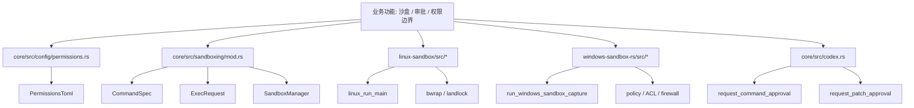
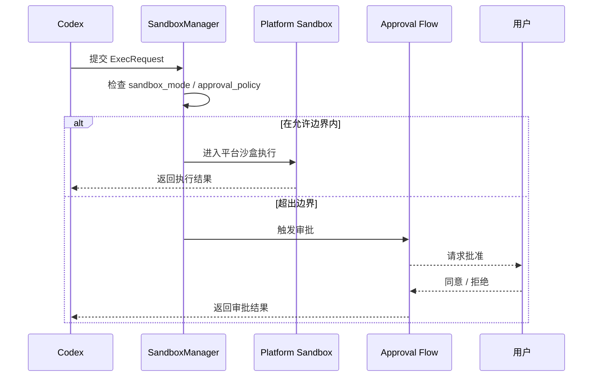

# 第09章 沙盒

> 原始页面：[Sandbox – Codex | OpenAI Developers](https://developers.openai.com/codex/concepts/sandboxing)

这一章讲的是边界。Codex 不是纯聊天工具，它会读文件、改文件、跑命令，所以必须先讲清楚它能做到哪里。

只要把“能力”和“权限”分开理解，这类章节就不会难。

## 数学类比
沙盒像在平面直角坐标系里画出的一个有边界的定义域。函数只能在定义域内取值，超出范围就不允许。

## 严谨定义
严格地说，沙盒是执行权限、文件范围和外部访问能力的约束集合。

## 本章先抓重点
- 沙盒是一个边界，可以让 Codex 自主运作，而不需要给予其对您机器的无限制访问。当 Codex 在 **Codex 应用程序**、**IDE 扩展**或 **CLI** 中运行本地命令时，这些命令会…
- `沙盒的作用`：沙盒适用于生成的命令，而不仅限于 Codex 内置的文件操作。如果 Codex 运行像 `git`、包管理器或测试运行器这样的工具，这些命令也会继承相同的沙盒边界。
- `重要性`：沙盒减少了批准疲劳。Codex 不再要求您确认每个低风险命令，而可以在您已经批准的边界内读取文件、进行编辑并运行例行项目命令。

## 正文整理
### 正文
沙盒是一个边界，可以让 Codex 自主运作，而不需要给予其对您机器的无限制访问。当 Codex 在 **Codex 应用程序**、**IDE 扩展**或 **CLI** 中运行本地命令时，这些命令会在一个受限的环境中运行，而不是默认情况下拥有完全访问权限。（实现：[sandboxing/mod](/config/workspace/codex/codex-rs/core/src/sandboxing/mod.rs:38)、[SandboxManager](/config/workspace/codex/codex-rs/core/src/sandboxing/mod.rs:291)、[config/permissions](/config/workspace/codex/codex-rs/core/src/config/permissions.rs:9)、[linux-sandbox](/config/workspace/codex/codex-rs/linux-sandbox/src/lib.rs:18)）

继续往下看，这一节还强调了两件事：
- 该环境定义了 Codex 自主行动的能力，比如它可以修改哪些文件，以及命令是否可以使用网络。当任务保持在这些边界内时，Codex 可以不断进行，而无需停下来确认。当它需要超越这些边界时，Codex 会回退到批准流程。（实现：[sandboxing/mod](/config/workspace/codex/codex-rs/core/src/sandboxing/mod.rs:38)、[SandboxManager](/config/workspace/codex/codex-rs/core/src/sandboxing/mod.rs:291)、[config/permissions](/config/workspace/codex/codex-rs/core/src/config/permissions.rs:9)、[linux-sandbox](/config/workspace/codex/codex-rs/linux-sandbox/src/lib.rs:18)）
- 沙盒和批准是不同的控制机制，它们共同发挥作用。沙盒定义了技术边界，而批准政策决定了何时 Codex 必须停止并询问才能越过这些边界。（实现：[sandboxing/mod](/config/workspace/codex/codex-rs/core/src/sandboxing/mod.rs:38)、[SandboxManager](/config/workspace/codex/codex-rs/core/src/sandboxing/mod.rs:291)、[config/permissions](/config/workspace/codex/codex-rs/core/src/config/permissions.rs:9)、[linux-sandbox](/config/workspace/codex/codex-rs/linux-sandbox/src/lib.rs:18)）

### 沙盒的作用
沙盒适用于生成的命令，而不仅限于 Codex 内置的文件操作。如果 Codex 运行像 `git`、包管理器或测试运行器这样的工具，这些命令也会继承相同的沙盒边界。（实现：[sandboxing/mod](/config/workspace/codex/codex-rs/core/src/sandboxing/mod.rs:38)、[SandboxManager](/config/workspace/codex/codex-rs/core/src/sandboxing/mod.rs:291)、[config/permissions](/config/workspace/codex/codex-rs/core/src/config/permissions.rs:9)、[linux-sandbox](/config/workspace/codex/codex-rs/linux-sandbox/src/lib.rs:18)）

继续往下看，这一节还强调了两件事：
- Codex 在每个操作系统上使用平台本地强制。实现会在 macOS、Linux、WSL2 和原生 Windows 之间有所不同，但在各个表面上的理念相同：为代理提供一个有界的工作场所，以便例行任务可以在明确的限制中自主运行。

### 重要性
沙盒减少了批准疲劳。Codex 不再要求您确认每个低风险命令，而可以在您已经批准的边界内读取文件、进行编辑并运行例行项目命令。（实现：[sandboxing/mod](/config/workspace/codex/codex-rs/core/src/sandboxing/mod.rs:38)、[SandboxManager](/config/workspace/codex/codex-rs/core/src/sandboxing/mod.rs:291)、[config/permissions](/config/workspace/codex/codex-rs/core/src/config/permissions.rs:9)、[linux-sandbox](/config/workspace/codex/codex-rs/linux-sandbox/src/lib.rs:18)）

继续往下看，这一节还强调了两件事：
- 它还为自主工作提供了更清晰的信任模型。您不仅在信任代理的意图；您还在信任代理在强制限制内运行。这使得让 Codex 独立工作变得更容易，同时仍然可以知道它何时会停止并请求帮助。（实现：[ModelsManager](/config/workspace/codex/codex-rs/core/src/models_manager/manager.rs:55)、[model_info](/config/workspace/codex/codex-rs/core/src/models_manager/model_info.rs:1)、[model_presets](/config/workspace/codex/codex-rs/core/src/models_manager/model_presets.rs:1)、[supported_models](/config/workspace/codex/codex-rs/app-server/src/models.rs:10)）

### 开始使用
Codex 在您使用默认权限模式时自动应用沙盒。（实现：[sandboxing/mod](/config/workspace/codex/codex-rs/core/src/sandboxing/mod.rs:38)、[SandboxManager](/config/workspace/codex/codex-rs/core/src/sandboxing/mod.rs:291)、[config/permissions](/config/workspace/codex/codex-rs/core/src/config/permissions.rs:9)、[linux-sandbox](/config/workspace/codex/codex-rs/linux-sandbox/src/lib.rs:18)）

### 前提条件
在 **macOS** 上，沙盒开箱即用，使用内置的 Seatbelt 框架。（实现：[sandboxing/mod](/config/workspace/codex/codex-rs/core/src/sandboxing/mod.rs:38)、[SandboxManager](/config/workspace/codex/codex-rs/core/src/sandboxing/mod.rs:291)、[config/permissions](/config/workspace/codex/codex-rs/core/src/config/permissions.rs:9)、[linux-sandbox](/config/workspace/codex/codex-rs/linux-sandbox/src/lib.rs:18)）

继续往下看，这一节还强调了两件事：
- 在 **Windows** 上，当您在 PowerShell 中运行时，Codex 使用原生的 Windows\\ 沙盒，而在 WSL2 中运行时使用 Linux 沙盒实现。（实现：[sandboxing/mod](/config/workspace/codex/codex-rs/core/src/sandboxing/mod.rs:38)、[SandboxManager](/config/workspace/codex/codex-rs/core/src/sandboxing/mod.rs:291)、[config/permissions](/config/workspace/codex/codex-rs/core/src/config/permissions.rs:9)、[linux-sandbox](/config/workspace/codex/codex-rs/linux-sandbox/src/lib.rs:18)）
- 在 **Linux 和 WSL2** 中，首先使用您的包管理器安装 `bubblewrap`：
- Ubuntu/DebianFedora

## 代码结构图
这张图对应“沙盒”在代码里的结构分层：最上层是权限配置和策略判断，下面才是不同平台的实际执行器。

## 实现流程图
这张图对应“代理准备执行命令时，系统如何根据沙盒边界和审批策略决定继续执行还是先停下来询问用户”。

## 小结
读完这一章后，最重要的不是记住页面上的每个术语，而是知道它在整个 Codex 体系里负责解决什么问题。
