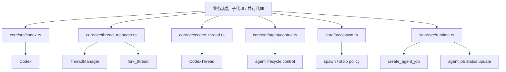
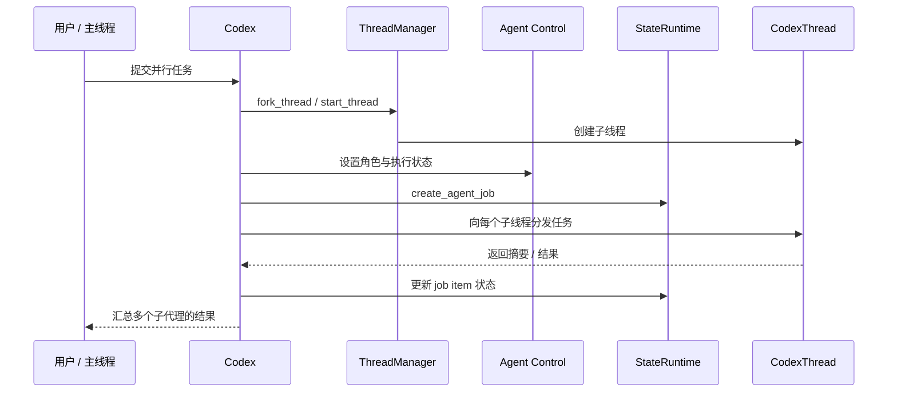

# 第10章 子代理

> 原始页面：[Subagents – Codex | OpenAI Developers](https://developers.openai.com/codex/concepts/subagents)

这一章讲子代理，也就是把一个大任务拆给多个代理分别处理，再把结果汇总回来。

如果你已经能理解“主线程”和“上下文”这两个词，这一章就会非常自然。

## 数学类比

子代理像把一道大题拆成几道小问：主问题不变，但每个小问由更专门的人分别处理。

## 严谨定义

严格地说，子代理是主代理派生出的局部求解器，拥有较小的任务域和更清晰的边界。

## 本章先抓重点

- Codex 可以通过并行生成专门的代理来运行子代理工作流，以便它们可以同时探索、处理或分析工作。
- `为什么子代理工作流有帮助`：即使有较大的上下文窗口，模型也是有限的。如果你用噪音的中间输出（如探索笔记、测试日志、堆栈跟踪和命令输出）淹没主对话（你在其中定义要求、约束和决策），会导致会话随着时间的…
- `核心术语`：Codex 在子代理工作流中使用几个相关术语：

## 正文整理

### 正文

Codex 可以通过并行生成专门的代理来运行子代理工作流，以便它们可以同时探索、处理或分析工作。（实现：[Codex](/config/workspace/codex/codex-rs/core/src/codex.rs:285)、[CodexThread](/config/workspace/codex/codex-rs/core/src/codex_thread.rs:37)、[ThreadManager::fork_thread](/config/workspace/codex/codex-rs/core/src/thread_manager.rs:375)、[agent/control](/config/workspace/codex/codex-rs/core/src/agent/control.rs:1)）

继续往下看，这一节还强调了两件事：

- 本页面解释了核心概念和权衡。有关设置、代理配置和示例，请参见 子代理。（实现：[Codex](/config/workspace/codex/codex-rs/core/src/codex.rs:285)、[CodexThread](/config/workspace/codex/codex-rs/core/src/codex_thread.rs:37)、[ThreadManager::fork_thread](/config/workspace/codex/codex-rs/core/src/thread_manager.rs:375)、[agent/control](/config/workspace/codex/codex-rs/core/src/agent/control.rs:1)）

### 为什么子代理工作流有帮助

即使有较大的上下文窗口，模型也是有限的。如果你用噪音的中间输出（如探索笔记、测试日志、堆栈跟踪和命令输出）淹没主对话（你在其中定义要求、约束和决策），会导致会话随着时间的推移变得不可靠。（实现：[CodexThread](/config/workspace/codex/codex-rs/core/src/codex_thread.rs:37)、[ThreadManager](/config/workspace/codex/codex-rs/core/src/thread_manager.rs:120)、[context_manager](/config/workspace/codex/codex-rs/core/src/context_manager/mod.rs:1)、[message_history](/config/workspace/codex/codex-rs/core/src/message_history.rs:1)）

继续往下看，这一节还强调了两件事：

- 这通常被描述为：
- **上下文污染**：有用的信息被埋没在嘈杂的中间输出之下。（实现：[CodexThread](/config/workspace/codex/codex-rs/core/src/codex_thread.rs:37)、[ThreadManager](/config/workspace/codex/codex-rs/core/src/thread_manager.rs:120)、[context_manager](/config/workspace/codex/codex-rs/core/src/context_manager/mod.rs:1)、[message_history](/config/workspace/codex/codex-rs/core/src/message_history.rs:1)）
- **上下文腐烂**：随着对话被不太相关的细节填充，性能下降。（实现：[CodexThread](/config/workspace/codex/codex-rs/core/src/codex_thread.rs:37)、[ThreadManager](/config/workspace/codex/codex-rs/core/src/thread_manager.rs:120)、[context_manager](/config/workspace/codex/codex-rs/core/src/context_manager/mod.rs:1)、[message_history](/config/workspace/codex/codex-rs/core/src/message_history.rs:1)）

### 核心术语

Codex 在子代理工作流中使用几个相关术语：（实现：[Codex](/config/workspace/codex/codex-rs/core/src/codex.rs:285)、[CodexThread](/config/workspace/codex/codex-rs/core/src/codex_thread.rs:37)、[ThreadManager::fork_thread](/config/workspace/codex/codex-rs/core/src/thread_manager.rs:375)、[agent/control](/config/workspace/codex/codex-rs/core/src/agent/control.rs:1)）

继续往下看，这一节还强调了两件事：

- **子代理工作流**：Codex 运行并行代理并组合其结果的工作流。（实现：[Codex](/config/workspace/codex/codex-rs/core/src/codex.rs:285)、[CodexThread](/config/workspace/codex/codex-rs/core/src/codex_thread.rs:37)、[ThreadManager::fork_thread](/config/workspace/codex/codex-rs/core/src/thread_manager.rs:375)、[agent/control](/config/workspace/codex/codex-rs/core/src/agent/control.rs:1)）
- **子代理**：Codex 启动以处理特定任务的代理。（实现：[Codex](/config/workspace/codex/codex-rs/core/src/codex.rs:285)、[CodexThread](/config/workspace/codex/codex-rs/core/src/codex_thread.rs:37)、[ThreadManager::fork_thread](/config/workspace/codex/codex-rs/core/src/thread_manager.rs:375)、[agent/control](/config/workspace/codex/codex-rs/core/src/agent/control.rs:1)）
- **代理线程**：代理的 CLI 线程，你可以通过 `/agent` 检查并在其间切换。（实现：[Codex](/config/workspace/codex/codex-rs/core/src/codex.rs:285)、[CodexThread](/config/workspace/codex/codex-rs/core/src/codex_thread.rs:37)、[ThreadManager::fork_thread](/config/workspace/codex/codex-rs/core/src/thread_manager.rs:375)、[agent/control](/config/workspace/codex/codex-rs/core/src/agent/control.rs:1)）

### 触发子代理工作流

Codex 不会自动生成子代理，只有在你明确要求子代理或并行代理工作时才应使用子代理。（实现：[Codex](/config/workspace/codex/codex-rs/core/src/codex.rs:285)、[CodexThread](/config/workspace/codex/codex-rs/core/src/codex_thread.rs:37)、[ThreadManager::fork_thread](/config/workspace/codex/codex-rs/core/src/thread_manager.rs:375)、[agent/control](/config/workspace/codex/codex-rs/core/src/agent/control.rs:1)）

继续往下看，这一节还强调了两件事：

- 实际上，手动触发意味着使用直接指令，例如“生成两个代理”、“并行分配此工作”或“一点使用一个代理”。子代理工作流消耗的令牌比可比的单代理运行更多，因为每个子代理都进行自己的模型和工具工作。（实现：[Codex](/config/workspace/codex/codex-rs/core/src/codex.rs:285)、[CodexThread](/config/workspace/codex/codex-rs/core/src/codex_thread.rs:37)、[ThreadManager::fork_thread](/config/workspace/codex/codex-rs/core/src/thread_manager.rs:375)、[agent/control](/config/workspace/codex/codex-rs/core/src/agent/control.rs:1)）
- 一个好的子代理提示应该解释如何划分工作，Codex 是否应在继续之前等待所有代理，以及应返回的摘要或输出。（实现：[Codex](/config/workspace/codex/codex-rs/core/src/codex.rs:285)、[CodexThread](/config/workspace/codex/codex-rs/core/src/codex_thread.rs:37)、[ThreadManager::fork_thread](/config/workspace/codex/codex-rs/core/src/thread_manager.rs:375)、[agent/control](/config/workspace/codex/codex-rs/core/src/agent/control.rs:1)）

### 选择模型和推理

不同的代理需要不同的模型和推理设置。（实现：[ModelsManager](/config/workspace/codex/codex-rs/core/src/models_manager/manager.rs:55)、[model_info](/config/workspace/codex/codex-rs/core/src/models_manager/model_info.rs:1)、[model_presets](/config/workspace/codex/codex-rs/core/src/models_manager/model_presets.rs:1)、[supported_models](/config/workspace/codex/codex-rs/app-server/src/models.rs:10)）

继续往下看，这一节还强调了两件事：

- 如果你不固定模型或 `model_reasoning_effort`，Codex 可以选择一种平衡任务的智能、速度和价格的设置。它可能偏爱 `gpt-5.4-mini` 用于快速扫描，或在该模型可用时更高努力的 `gpt-5.5` 配置以进行更具挑战性的推理。当你需要更精细的控制时，可以在提示中引导该选择，或直接在代理文件中设置 `model` 和 `mod…（实现：[ModelsManager](/config/workspace/codex/codex-rs/core/src/models_manager/manager.rs:55)、[model_info](/config/workspace/codex/codex-rs/core/src/models_manager/model_info.rs:1)、[model_presets](/config/workspace/codex/codex-rs/core/src/models_manager/model_presets.rs:1)、[supported_models](/config/workspace/codex/codex-rs/app-server/src/models.rs:10)）
- 对于 Codex 中的大多数任务，当 `gpt-5.5` 可用时，请从 `gpt-5.5` 开始。如果 `gpt-5.5` 尚不可用，请在推送期间继续使用 `gpt-5.4`。当你希望为较轻的子代理工作寻求更快、更低成本的选项时，请使用 `gpt-5.4-mini`。如果你拥有 ChatGPT Pr…（实现：[Codex](/config/workspace/codex/codex-rs/core/src/codex.rs:285)、[CodexThread](/config/workspace/codex/codex-rs/core/src/codex_thread.rs:37)、[ThreadManager::fork_thread](/config/workspace/codex/codex-rs/core/src/thread_manager.rs:375)、[agent/control](/config/workspace/codex/codex-rs/core/src/agent/control.rs:1)）

## 代码结构图

下面这张图对应“子代理”在代码中的静态结构，也就是它分别落在业务编排、线程管理、代理控制和状态持久化哪些位置。

## 实现流程图

下面这张图对应“主线程收到并行任务后，系统内部怎样把任务拆成多个子代理，再把结果收回”。

## 小结

读完这一章后，最重要的不是记住页面上的每个术语，而是知道它在整个 Codex 体系里负责解决什么问题。
