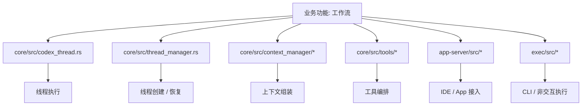
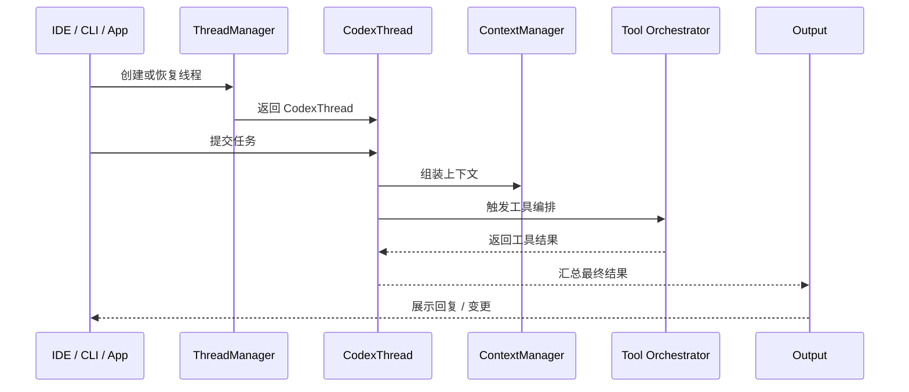

# 第11章 工作流

> 原始页面：[Workflows – Codex | OpenAI Developers](https://developers.openai.com/codex/workflows)

这一章不是解释单个按钮，而是在讲怎样把 Codex 放进真实任务流程中。

可以把它理解成“从会问问题，到会做事情”的过渡章节。

## 数学类比
把提示词想成做几何证明时的题目条件。条件越完整，证明路径越短；条件越含糊，辅助线就会乱加。

## 严谨定义
严格地说，提示是对目标函数、约束条件和验证标准的联合描述。

## 本章先抓重点
- Codex 在您将其视为一个具有明确上下文和“完成”清晰定义的队友时效果最佳。 此页面提供了 Codex IDE 扩展、Codex CLI 和 Codex 云的端到端工作流示例。
- `如何阅读这些示例`：每个工作流包括：
- `解释代码库`：在您入职、继承服务或试图理解协议、数据模型或请求流程时使用此功能。

## 正文整理
### 正文
Codex 在您将其视为一个具有明确上下文和“完成”清晰定义的队友时效果最佳。 此页面提供了 Codex IDE 扩展、Codex CLI 和 Codex 云的端到端工作流示例。（实现：[CodexThread](/config/workspace/codex/codex-rs/core/src/codex_thread.rs:37)、[ThreadManager](/config/workspace/codex/codex-rs/core/src/thread_manager.rs:120)、[context_manager](/config/workspace/codex/codex-rs/core/src/context_manager/mod.rs:1)、[message_history](/config/workspace/codex/codex-rs/core/src/message_history.rs:1)）

继续往下看，这一节还强调了两件事：
- 如果您是 Codex 的新手，请先阅读 提示，然后再回来查看具体配方。（实现：[custom_prompts](/config/workspace/codex/codex-rs/core/src/custom_prompts.rs:9)、[project_doc](/config/workspace/codex/codex-rs/core/src/project_doc.rs:134)、[instructions/user_instructions](/config/workspace/codex/codex-rs/core/src/instructions/user_instructions.rs:1)）

### 如何阅读这些示例
每个工作流包括：

继续往下看，这一节还强调了两件事：
- **何时使用**以及哪个 Codex 表面最合适（IDE、CLI 或云）。（实现：[app-server run_main](/config/workspace/codex/codex-rs/app-server/src/lib.rs:295)、[CodexMessageProcessor](/config/workspace/codex/codex-rs/app-server/src/codex_message_processor.rs:399)、[transport](/config/workspace/codex/codex-rs/app-server/src/transport.rs:73)、[thread_state](/config/workspace/codex/codex-rs/app-server/src/thread_state.rs:1)）
- **步骤**，带有示例用户提示。（实现：[custom_prompts](/config/workspace/codex/codex-rs/core/src/custom_prompts.rs:9)、[project_doc](/config/workspace/codex/codex-rs/core/src/project_doc.rs:134)、[instructions/user_instructions](/config/workspace/codex/codex-rs/core/src/instructions/user_instructions.rs:1)）
- **上下文说明**：Codex 自动看到的内容与您需要附加的内容。（实现：[CodexThread](/config/workspace/codex/codex-rs/core/src/codex_thread.rs:37)、[ThreadManager](/config/workspace/codex/codex-rs/core/src/thread_manager.rs:120)、[context_manager](/config/workspace/codex/codex-rs/core/src/context_manager/mod.rs:1)、[message_history](/config/workspace/codex/codex-rs/core/src/message_history.rs:1)）

### 解释代码库
在您入职、继承服务或试图理解协议、数据模型或请求流程时使用此功能。（实现：[ModelsManager](/config/workspace/codex/codex-rs/core/src/models_manager/manager.rs:55)、[model_info](/config/workspace/codex/codex-rs/core/src/models_manager/model_info.rs:1)、[model_presets](/config/workspace/codex/codex-rs/core/src/models_manager/model_presets.rs:1)、[supported_models](/config/workspace/codex/codex-rs/app-server/src/models.rs:10)）

### IDE 扩展工作流（适合本地探索）
1. 打开最相关的文件。

继续往下看，这一节还强调了两件事：
- 2. 选择您关心的代码（可选，但推荐）。
- 3. 提示 Codex：（实现：[custom_prompts](/config/workspace/codex/codex-rs/core/src/custom_prompts.rs:9)、[project_doc](/config/workspace/codex/codex-rs/core/src/project_doc.rs:134)、[instructions/user_instructions](/config/workspace/codex/codex-rs/core/src/instructions/user_instructions.rs:1)）
- 包括：

### CLI 工作流（在您希望获得转录 + shell 命令时）
1. 开始一个交互式会话：（实现：[CodexThread](/config/workspace/codex/codex-rs/core/src/codex_thread.rs:37)、[ThreadManager](/config/workspace/codex/codex-rs/core/src/thread_manager.rs:120)、[context_manager](/config/workspace/codex/codex-rs/core/src/context_manager/mod.rs:1)、[message_history](/config/workspace/codex/codex-rs/core/src/message_history.rs:1)）

继续往下看，这一节还强调了两件事：
- 2. 附加文件（可选）并提示：（实现：[custom_prompts](/config/workspace/codex/codex-rs/core/src/custom_prompts.rs:9)、[project_doc](/config/workspace/codex/codex-rs/core/src/project_doc.rs:134)、[instructions/user_instructions](/config/workspace/codex/codex-rs/core/src/instructions/user_instructions.rs:1)）
- 上下文说明：（实现：[CodexThread](/config/workspace/codex/codex-rs/core/src/codex_thread.rs:37)、[ThreadManager](/config/workspace/codex/codex-rs/core/src/thread_manager.rs:120)、[context_manager](/config/workspace/codex/codex-rs/core/src/context_manager/mod.rs:1)、[message_history](/config/workspace/codex/codex-rs/core/src/message_history.rs:1)）
- 您可以在 composer 中使用 `@` 插入来自工作区的文件路径，或者 `/mention` 附加特定文件。

## 代码结构图
工作流章节对应的不是单一模块，而是把提示、线程、工具和客户端入口串起来的整体执行面。

## 实现流程图
这张图对应“一个完整业务工作流如何从客户端入口进入，再经过线程、上下文、工具执行，最后返回结果”。

## 小结
读完这一章后，最重要的不是记住页面上的每个术语，而是知道它在整个 Codex 体系里负责解决什么问题。
