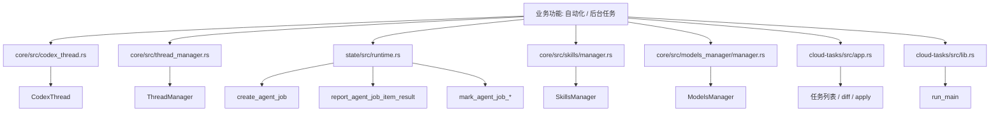
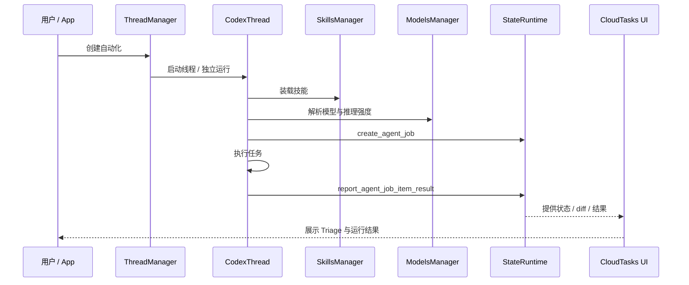

# 第18章 自动化

> 原始页面：[Automations – Codex app | OpenAI Developers](https://developers.openai.com/codex/app/automations)

这一章讲如何把重复任务交给 Codex 自动执行，让它不只是一次性回应，而是能持续工作。

理解自动化时，关键不是“怎么点按钮”，而是“什么任务值得自动化”。

## 数学类比
把自动化看成数列中的递推过程。你先给出初值和递推规则，之后系统会在每个时刻自动算出下一项。

## 严谨定义
严格地说，自动化就是一个由“触发条件 + 指令 + 执行环境 + 输出汇总”组成的重复映射。

## 本章先抓重点
- 在后台自动化处理重复任务。Codex 添加发现到收件箱，或者如果没有报告内容，则自动归档任务。您可以将自动化与 技能 结合使用以处理更复杂的任务。
- `管理任务`：在您的 Codex 应用程序侧边栏中的自动化窗格中寻找所有自动化及其运行情况。
- `请求 Codex 创建或更新自动化`：您可以从常规 Codex 线程中创建和更新自动化。描述任务、调度时间，以及自动化是否应与当前线程保持关联或启动全新运行。Codex 可以起草自动化提示，选择正确…

## 正文整理
### 正文
在后台自动化处理重复任务。Codex 添加发现到收件箱，或者如果没有报告内容，则自动归档任务。您可以将自动化与 技能 结合使用以处理更复杂的任务。（实现：[SkillsManager](/config/workspace/codex/codex-rs/core/src/skills/manager.rs:26)、[skills/loader](/config/workspace/codex/codex-rs/core/src/skills/loader.rs:1)、[skills/injection](/config/workspace/codex/codex-rs/core/src/skills/injection.rs:1)、[skills/permissions](/config/workspace/codex/codex-rs/core/src/skills/permissions.rs:1)）

继续往下看，这一节还强调了两件事：
- 对于项目范围的自动化，应用程序需要运行，所选项目需要在磁盘上可用。（实现：[StateRuntime::create_agent_job](/config/workspace/codex/codex-rs/state/src/runtime.rs:917)、[StateRuntime::report_agent_job_item_result](/config/workspace/codex/codex-rs/state/src/runtime.rs:1337)、[cloud-tasks App](/config/workspace/codex/codex-rs/cloud-tasks/src/app.rs:47)、[cloud-tasks CLI](/config/workspace/codex/codex-rs/cloud-tasks/src/cli.rs:7)）
- 在 Git 仓库中，您可以选择自动化是在本地项目中运行还是在新的 工作树 上运行。两种选项都在后台运行。工作树保持自动化更改与未完成的本地工作分开，而在本地项目中运行可以修改您仍在处理的文件。在非版本控制的项目中，自动化直接在项目目录中运行。（实现：[StateRuntime::create_agent_job](/config/workspace/codex/codex-rs/state/src/runtime.rs:917)、[StateRuntime::report_agent_job_item_result](/config/workspace/codex/codex-rs/state/src/runtime.rs:1337)、[cloud-tasks App](/config/workspace/codex/codex-rs/cloud-tasks/src/app.rs:47)、[cloud-tasks CLI](/config/workspace/codex/codex-rs/cloud-tasks/src/cli.rs:7)）
- 您还可以保持模型和推理努力的默认设置，或者如果您希望对自动化的运行有更多控制，也可以明确选择它们。（实现：[ModelsManager](/config/workspace/codex/codex-rs/core/src/models_manager/manager.rs:55)、[model_info](/config/workspace/codex/codex-rs/core/src/models_manager/model_info.rs:1)、[model_presets](/config/workspace/codex/codex-rs/core/src/models_manager/model_presets.rs:1)、[supported_models](/config/workspace/codex/codex-rs/app-server/src/models.rs:10)）

### 管理任务
在您的 Codex 应用程序侧边栏中的自动化窗格中寻找所有自动化及其运行情况。（实现：[StateRuntime::create_agent_job](/config/workspace/codex/codex-rs/state/src/runtime.rs:917)、[StateRuntime::report_agent_job_item_result](/config/workspace/codex/codex-rs/state/src/runtime.rs:1337)、[cloud-tasks App](/config/workspace/codex/codex-rs/cloud-tasks/src/app.rs:47)、[cloud-tasks CLI](/config/workspace/codex/codex-rs/cloud-tasks/src/cli.rs:7)）

继续往下看，这一节还强调了两件事：
- “Triage” 部分充当您的收件箱。具有发现的自动化运行将显示在此处，您可以筛选收件箱以显示所有自动化运行或仅未读内容。（实现：[StateRuntime::create_agent_job](/config/workspace/codex/codex-rs/state/src/runtime.rs:917)、[StateRuntime::report_agent_job_item_result](/config/workspace/codex/codex-rs/state/src/runtime.rs:1337)、[cloud-tasks App](/config/workspace/codex/codex-rs/cloud-tasks/src/app.rs:47)、[cloud-tasks CLI](/config/workspace/codex/codex-rs/cloud-tasks/src/cli.rs:7)）
- 独立自动化按计划启动全新运行并在 Triage 中报告结果。当每个运行应该是独立的，或者当一个自动化应该在一个或多个项目中运行时，使用它们。如果您需要自定义的节奏，请选择自定义调度并输入 cron 语法。（实现：[StateRuntime::create_agent_job](/config/workspace/codex/codex-rs/state/src/runtime.rs:917)、[StateRuntime::report_agent_job_item_result](/config/workspace/codex/codex-rs/state/src/runtime.rs:1337)、[cloud-tasks App](/config/workspace/codex/codex-rs/cloud-tasks/src/app.rs:47)、[cloud-tasks CLI](/config/workspace/codex/codex-rs/cloud-tasks/src/cli.rs:7)）
- 对于 Git 仓库，每个自动化可以运行在您的本地项目中，或者在专用的后台 工作树 上。使用工作树时，希望将自动化更改与未完成的本地工作隔离开来。使用本地模式时，希望自动化直接在您的主签出中工作，请记住它可能会更改您正在积极编辑的文件。在非版本控制的项目中，自动化直接在项目目录中运行。您可以让同一个自…（实现：[StateRuntime::create_agent_job](/config/workspace/codex/codex-rs/state/src/runtime.rs:917)、[StateRuntime::report_agent_job_item_result](/config/workspace/codex/codex-rs/state/src/runtime.rs:1337)、[cloud-tasks App](/config/workspace/codex/codex-rs/cloud-tasks/src/app.rs:47)、[cloud-tasks CLI](/config/workspace/codex/codex-rs/cloud-tasks/src/cli.rs:7)）

### 请求 Codex 创建或更新自动化
您可以从常规 Codex 线程中创建和更新自动化。描述任务、调度时间，以及自动化是否应与当前线程保持关联或启动全新运行。Codex 可以起草自动化提示，选择正确的自动化类型，并在范围或节奏变化时更新它。（实现：[CodexThread](/config/workspace/codex/codex-rs/core/src/codex_thread.rs:37)、[ThreadManager](/config/workspace/codex/codex-rs/core/src/thread_manager.rs:120)、[context_manager](/config/workspace/codex/codex-rs/core/src/context_manager/mod.rs:1)、[message_history](/config/workspace/codex/codex-rs/core/src/message_history.rs:1)）

继续往下看，这一节还强调了两件事：
- 例如，请求 Codex 在部署完成时在此线程中提醒您，或者请求它创建一个独立的自动化，在定期的时间表上检查项目。（实现：[CodexThread](/config/workspace/codex/codex-rs/core/src/codex_thread.rs:37)、[ThreadManager](/config/workspace/codex/codex-rs/core/src/thread_manager.rs:120)、[context_manager](/config/workspace/codex/codex-rs/core/src/context_manager/mod.rs:1)、[message_history](/config/workspace/codex/codex-rs/core/src/message_history.rs:1)）
- 技能也可以创建或更新自动化。例如，用于照看拉取请求的技能可以设置定期自动化，使用 GitHub 插件检查 PR 状态并修复新审查反馈。（实现：[SkillsManager](/config/workspace/codex/codex-rs/core/src/skills/manager.rs:26)、[skills/loader](/config/workspace/codex/codex-rs/core/src/skills/loader.rs:1)、[skills/injection](/config/workspace/codex/codex-rs/core/src/skills/injection.rs:1)、[skills/permissions](/config/workspace/codex/codex-rs/core/src/skills/permissions.rs:1)）

### 线程自动化
线程自动化是附加到当前线程的心跳样式的定期唤醒调用。当您希望 Codex 定期返回到相同的对话中时，请使用它们。（实现：[CodexThread](/config/workspace/codex/codex-rs/core/src/codex_thread.rs:37)、[ThreadManager](/config/workspace/codex/codex-rs/core/src/thread_manager.rs:120)、[context_manager](/config/workspace/codex/codex-rs/core/src/context_manager/mod.rs:1)、[message_history](/config/workspace/codex/codex-rs/core/src/message_history.rs:1)）

继续往下看，这一节还强调了两件事：
- 当计划工作应保留线程的上下文而不是每次从新的提示开始时，请使用线程自动化。（实现：[CodexThread](/config/workspace/codex/codex-rs/core/src/codex_thread.rs:37)、[ThreadManager](/config/workspace/codex/codex-rs/core/src/thread_manager.rs:120)、[context_manager](/config/workspace/codex/codex-rs/core/src/context_manager/mod.rs:1)、[message_history](/config/workspace/codex/codex-rs/core/src/message_history.rs:1)）
- 线程自动化可以使用基于分钟的时间间隔进行积极的跟进循环，或者在您需要在特定时间进行检查时使用每日和每周的计划。（实现：[CodexThread](/config/workspace/codex/codex-rs/core/src/codex_thread.rs:37)、[ThreadManager](/config/workspace/codex/codex-rs/core/src/thread_manager.rs:120)、[context_manager](/config/workspace/codex/codex-rs/core/src/context_manager/mod.rs:1)、[message_history](/config/workspace/codex/codex-rs/core/src/message_history.rs:1)）
- 线程自动化非常有用：（实现：[CodexThread](/config/workspace/codex/codex-rs/core/src/codex_thread.rs:37)、[ThreadManager](/config/workspace/codex/codex-rs/core/src/thread_manager.rs:120)、[context_manager](/config/workspace/codex/codex-rs/core/src/context_manager/mod.rs:1)、[message_history](/config/workspace/codex/codex-rs/core/src/message_history.rs:1)）

### 测试自动化
在您安排自动化之前，首先在常规线程中手动测试提示。这有助于您确认：（实现：[CodexThread](/config/workspace/codex/codex-rs/core/src/codex_thread.rs:37)、[ThreadManager](/config/workspace/codex/codex-rs/core/src/thread_manager.rs:120)、[context_manager](/config/workspace/codex/codex-rs/core/src/context_manager/mod.rs:1)、[message_history](/config/workspace/codex/codex-rs/core/src/message_history.rs:1)）

继续往下看，这一节还强调了两件事：
- 提示清晰且范围正确。（实现：[custom_prompts](/config/workspace/codex/codex-rs/core/src/custom_prompts.rs:9)、[project_doc](/config/workspace/codex/codex-rs/core/src/project_doc.rs:134)、[instructions/user_instructions](/config/workspace/codex/codex-rs/core/src/instructions/user_instructions.rs:1)）
- 选择的或默认模型、推理努力和工具的行为符合预期。（实现：[tools/orchestrator](/config/workspace/codex/codex-rs/core/src/tools/orchestrator.rs:43)、[tools/router](/config/workspace/codex/codex-rs/core/src/tools/router.rs:1)、[tools/registry](/config/workspace/codex/codex-rs/core/src/tools/registry.rs:1)、[unified_exec/mod](/config/workspace/codex/codex-rs/core/src/unified_exec/mod.rs:74)）
- 结果差异可供审查。

## 代码结构图
自动化不是单个页面功能，而是由线程能力、任务状态持久化、技能注入、模型选择和任务展示一起拼出来的业务模块。

## 实现流程图
这张图对应“创建一个自动化任务后，它如何在系统里变成可执行、可跟踪、可汇总的后台流程”。

## 小结
读完这一章后，最重要的不是记住页面上的每个术语，而是知道它在整个 Codex 体系里负责解决什么问题。
