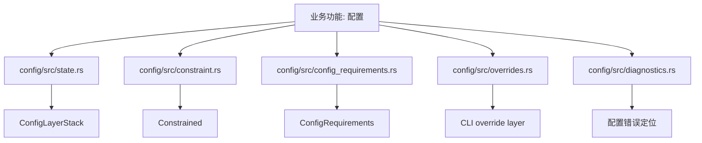
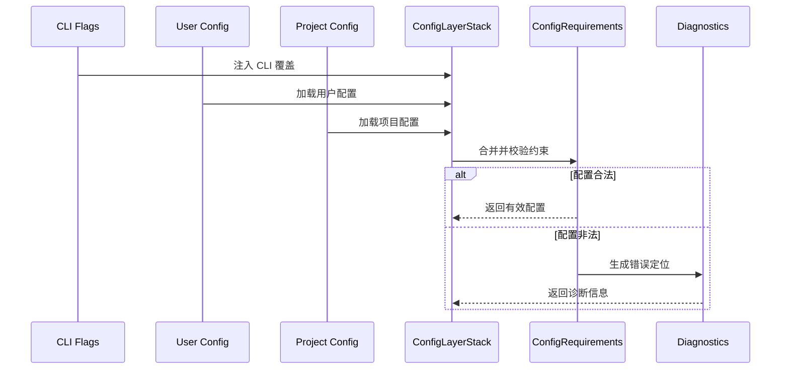

# 第43章 配置基础

> 原始页面：[Config basics – Codex | OpenAI Developers](https://developers.openai.com/codex/config-basic)

这一章主要把官方页面里的内容重新整理成顺着读也能理解的讲解。

阅读时可以先抓住它解决的问题，再看它的操作方式和限制条件。

## 本章先抓重点
- Codex 从多个位置读取配置细节。您的个人默认值存储在 `~/.codex/config.toml` 中，您可以通过 `.codex/config.toml` 文件添加项目覆盖。出于安全原因，Cod…
- `Codex 配置文件`：Codex 在 `~/.codex/config.toml` 中存储用户级配置。要将设置范围限制为特定项目或子文件夹，请在您的代码仓库中添加 `.codex/config.t…
- `配置优先级`：Codex 按以下顺序解析值（优先级最高的在前）：

## 正文整理
### 正文
Codex 从多个位置读取配置细节。您的个人默认值存储在 `~/.codex/config.toml` 中，您可以通过 `.codex/config.toml` 文件添加项目覆盖。出于安全原因，Codex 仅在您信任该项目时加载项目 `.codex/` 层。（实现：[config/state](/codex/codex-rs/config/src/state.rs#L118)、[config/constraint](/codex/codex-rs/config/src/constraint.rs#L51)、[config/config_requirements](/codex/codex-rs/config/src/config_requirements.rs#L78)、[config/overrides](/codex/codex-rs/config/src/overrides.rs#L7)）

### Codex 配置文件
Codex 在 `~/.codex/config.toml` 中存储用户级配置。要将设置范围限制为特定项目或子文件夹，请在您的代码仓库中添加 `.codex/config.toml` 文件。（实现：[config/state](/codex/codex-rs/config/src/state.rs#L118)、[config/constraint](/codex/codex-rs/config/src/constraint.rs#L51)、[config/config_requirements](/codex/codex-rs/config/src/config_requirements.rs#L78)、[config/overrides](/codex/codex-rs/config/src/overrides.rs#L7)）

继续往下看，这一节还强调了两件事：
- 要从 Codex IDE 扩展中打开配置文件，请选择右上角的齿轮图标，然后选择 **Codex 设置 > 打开 config.toml**。（实现：[config/state](/codex/codex-rs/config/src/state.rs#L118)、[config/constraint](/codex/codex-rs/config/src/constraint.rs#L51)、[config/config_requirements](/codex/codex-rs/config/src/config_requirements.rs#L78)、[config/overrides](/codex/codex-rs/config/src/overrides.rs#L7)）
- CLI 和 IDE 扩展共享相同的配置层。您可以使用它们来：（实现：[config/state](/codex/codex-rs/config/src/state.rs#L118)、[config/constraint](/codex/codex-rs/config/src/constraint.rs#L51)、[config/config_requirements](/codex/codex-rs/config/src/config_requirements.rs#L78)、[config/overrides](/codex/codex-rs/config/src/overrides.rs#L7)）
- 设置默认模型和提供程序。（实现：[ModelsManager](/codex/codex-rs/core/src/models_manager/manager.rs#L55)、[model_info](/codex/codex-rs/core/src/models_manager/model_info.rs#L1)、[model_presets](/codex/codex-rs/core/src/models_manager/model_presets.rs#L1)、[supported_models](/codex/codex-rs/app-server/src/models.rs#L10)）

### 配置优先级
Codex 按以下顺序解析值（优先级最高的在前）：

继续往下看，这一节还强调了两件事：
- 1. CLI 标志和 `--config` 覆盖 2. 配置文件 值（来自 `--profile <name>`） 3. 项目配置文件：`.codex/config.toml`，从项目根向下到您当前的工作目录（离得近者优先；仅限受信任项目） 4. 用户配置：`~/.codex/config.toml` 5. 系统配置（如果存在）：Unix 上的 `/etc/…（实现：[config/state](/codex/codex-rs/config/src/state.rs#L118)、[config/constraint](/codex/codex-rs/config/src/constraint.rs#L51)、[config/config_requirements](/codex/codex-rs/config/src/config_requirements.rs#L78)、[config/overrides](/codex/codex-rs/config/src/overrides.rs#L7)）
- 使用该优先级在顶层设置共享默认值，并保持配置文件集中于不同值。（实现：[config/state](/codex/codex-rs/config/src/state.rs#L118)、[config/constraint](/codex/codex-rs/config/src/constraint.rs#L51)、[config/config_requirements](/codex/codex-rs/config/src/config_requirements.rs#L78)、[config/overrides](/codex/codex-rs/config/src/overrides.rs#L7)）
- 如果您将项目标记为不受信任，Codex 将跳过项目范围 `.codex/` 层，包括项目本地配置、钩子和规则。用户和系统配置仍将加载，包括用户/全局钩子和规则。（实现：[config/state](/codex/codex-rs/config/src/state.rs#L118)、[config/constraint](/codex/codex-rs/config/src/constraint.rs#L51)、[config/config_requirements](/codex/codex-rs/config/src/config_requirements.rs#L78)、[config/overrides](/codex/codex-rs/config/src/overrides.rs#L7)）

### 常见配置选项
以下是人们最常更改的一些选项：

### 默认模型
选择 Codex 默认使用的模型，在 CLI 和 IDE 中。（实现：[ModelsManager](/codex/codex-rs/core/src/models_manager/manager.rs#L55)、[model_info](/codex/codex-rs/core/src/models_manager/model_info.rs#L1)、[model_presets](/codex/codex-rs/core/src/models_manager/model_presets.rs#L1)、[supported_models](/codex/codex-rs/app-server/src/models.rs#L10)）

## 代码结构图
配置系统的实现重点是“多层来源 + 约束模型 + 合并与诊断”，而不是单纯读一个 `config.toml`。

## 实现流程图
这张图对应“Codex 启动时如何从多个配置来源读取、合并、校验，再形成最终有效配置”。

## 小结
读完这一章后，最重要的不是记住页面上的每个术语，而是知道它在整个 Codex 体系里负责解决什么问题。
