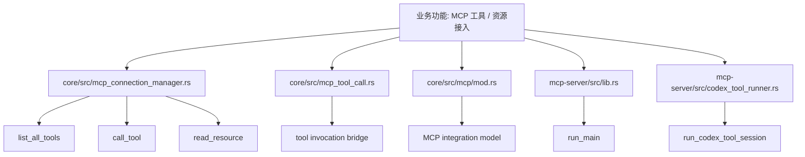
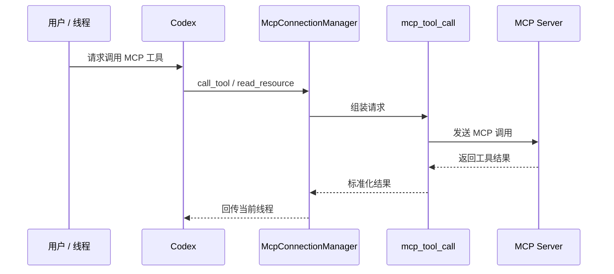

# 第51章 MCP

> 原始页面：[Model Context Protocol – Codex | OpenAI Developers](https://developers.openai.com/codex/mcp)

这一章主要把官方页面里的内容重新整理成顺着读也能理解的讲解。

阅读时可以先抓住它解决的问题，再看它的操作方式和限制条件。

## 数学类比
配置像给函数预先设定参数。公式不变，但参数不同，图像和输出会明显不同。

## 严谨定义
严格地说，配置是运行时行为的参数化描述。

## 本章先抓重点
- 模型上下文协议 (MCP) 将模型连接到工具和上下文。使用它来让 Codex 访问第三方文档，或者让它与开发者工具如您的浏览器或 Figma 进行交互。
- `支持的 MCP 特性`：- **STDIO 服务器**：作为本地进程运行的服务器（通过命令启动）。
- `将 Codex 连接到 MCP 服务器`：Codex 将 MCP 配置存储在 `config.toml` 中，与其他 Codex 配置设置并排放置。默认情况下是 `~/.codex/config.t…

## 正文整理
### 正文
模型上下文协议 (MCP) 将模型连接到工具和上下文。使用它来让 Codex 访问第三方文档，或者让它与开发者工具如您的浏览器或 Figma 进行交互。（实现：[CodexThread](/codex/codex-rs/core/src/codex_thread.rs#L37)、[ThreadManager](/codex/codex-rs/core/src/thread_manager.rs#L120)、[context_manager](/codex/codex-rs/core/src/context_manager/mod.rs#L1)、[message_history](/codex/codex-rs/core/src/message_history.rs#L1)）

继续往下看，这一节还强调了两件事：
- Codex 在 CLI 和 IDE 插件中均支持 MCP 服务器。（实现：[mcp_connection_manager](/codex/codex-rs/core/src/mcp_connection_manager.rs#L546)、[mcp_tool_call](/codex/codex-rs/core/src/mcp_tool_call.rs#L1)、[core/mcp/mod](/codex/codex-rs/core/src/mcp/mod.rs#L1)、[mcp-server/lib](/codex/codex-rs/mcp-server/src/lib.rs#L51)）

### 支持的 MCP 特性
**STDIO 服务器**：作为本地进程运行的服务器（通过命令启动）。

继续往下看，这一节还强调了两件事：
- 环境变量
- **可流式传输的 HTTP 服务器**：通过地址访问的服务器。
- Bearer 令牌身份验证

### 将 Codex 连接到 MCP 服务器
Codex 将 MCP 配置存储在 `config.toml` 中，与其他 Codex 配置设置并排放置。默认情况下是 `~/.codex/config.toml`，但您也可以通过 `.codex/config.toml`（仅限受信项目）将 MCP 服务器范围限制到一个项目。（实现：[mcp_connection_manager](/codex/codex-rs/core/src/mcp_connection_manager.rs#L546)、[mcp_tool_call](/codex/codex-rs/core/src/mcp_tool_call.rs#L1)、[core/mcp/mod](/codex/codex-rs/core/src/mcp/mod.rs#L1)、[mcp-server/lib](/codex/codex-rs/mcp-server/src/lib.rs#L51)）

继续往下看，这一节还强调了两件事：
- CLI 和 IDE 插件共享此配置。一旦配置了 MCP 服务器，您可以在两个 Codex 客户端之间切换，而无需重新设置。（实现：[mcp_connection_manager](/codex/codex-rs/core/src/mcp_connection_manager.rs#L546)、[mcp_tool_call](/codex/codex-rs/core/src/mcp_tool_call.rs#L1)、[core/mcp/mod](/codex/codex-rs/core/src/mcp/mod.rs#L1)、[mcp-server/lib](/codex/codex-rs/mcp-server/src/lib.rs#L51)）
- 要配置 MCP 服务器，请选择一个选项：（实现：[mcp_connection_manager](/codex/codex-rs/core/src/mcp_connection_manager.rs#L546)、[mcp_tool_call](/codex/codex-rs/core/src/mcp_tool_call.rs#L1)、[core/mcp/mod](/codex/codex-rs/core/src/mcp/mod.rs#L1)、[mcp-server/lib](/codex/codex-rs/mcp-server/src/lib.rs#L51)）
- 1. **使用 CLI**：运行 `codex mcp` 添加和管理服务器。 2. **编辑 `config.toml`**：直接更新 `~/.codex/config.toml`（或在受信项目中的项目范围的 `.codex/config.toml`）。（实现：[mcp_connection_manager](/codex/codex-rs/core/src/mcp_connection_manager.rs#L546)、[mcp_tool_call](/codex/codex-rs/core/src/mcp_tool_call.rs#L1)、[core/mcp/mod](/codex/codex-rs/core/src/mcp/mod.rs#L1)、[mcp-server/lib](/codex/codex-rs/mcp-server/src/lib.rs#L51)）

### 添加 MCP 服务器
例如，要添加 Context7（一个免费用于开发文档的 MCP 服务器），您可以运行以下命令：（实现：[mcp_connection_manager](/codex/codex-rs/core/src/mcp_connection_manager.rs#L546)、[mcp_tool_call](/codex/codex-rs/core/src/mcp_tool_call.rs#L1)、[core/mcp/mod](/codex/codex-rs/core/src/mcp/mod.rs#L1)、[mcp-server/lib](/codex/codex-rs/mcp-server/src/lib.rs#L51)）

### 其他 CLI 命令
要查看所有可用的 MCP 命令，您可以运行 `codex mcp --help`。（实现：[mcp_connection_manager](/codex/codex-rs/core/src/mcp_connection_manager.rs#L546)、[mcp_tool_call](/codex/codex-rs/core/src/mcp_tool_call.rs#L1)、[core/mcp/mod](/codex/codex-rs/core/src/mcp/mod.rs#L1)、[mcp-server/lib](/codex/codex-rs/mcp-server/src/lib.rs#L51)）

## 代码结构图
MCP 的结构本质上分成三层：连接管理层、工具调用桥接层、服务端协议层。

## 实现流程图
这张图对应“业务线程调用一个 MCP 工具时，调用链怎样从核心层一路走到 MCP 服务端，再返回结果”。

## 小结
读完这一章后，最重要的不是记住页面上的每个术语，而是知道它在整个 Codex 体系里负责解决什么问题。
