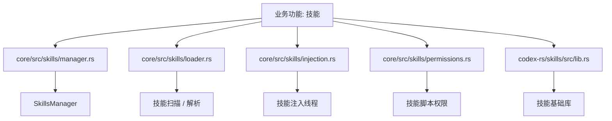
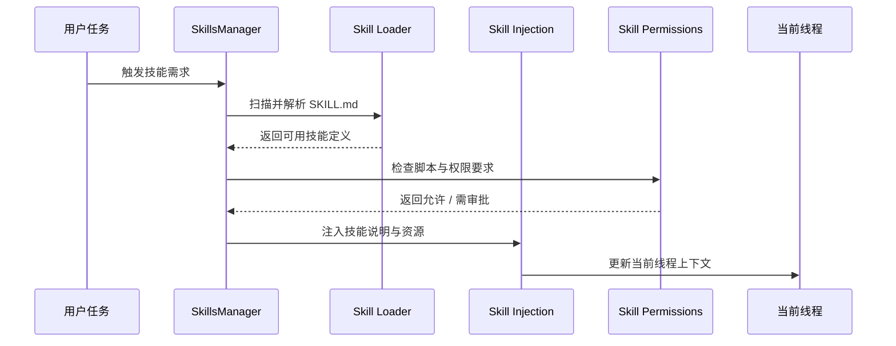

# 第54章 技能

> 原始页面：[Agent Skills – Codex | OpenAI Developers](https://developers.openai.com/codex/skills)

这一章主要把官方页面里的内容重新整理成顺着读也能理解的讲解。

阅读时可以先抓住它解决的问题，再看它的操作方式和限制条件。

## 数学类比
把提示词想成做几何证明时的题目条件。条件越完整，证明路径越短；条件越含糊，辅助线就会乱加。

## 严谨定义
严格地说，提示是对目标函数、约束条件和验证标准的联合描述。

## 本章先抓重点
- 使用代理技能扩展 Codex 的任务特定功能。技能打包了指令、资源和可选脚本，以便 Codex 能够可靠地遵循工作流。技能基于 开放代理技能标准。
- `Codex 如何使用技能`：Codex 可以通过两种方式激活技能：
- `创建技能`：首先使用内置的创建器：

## 正文整理
### 正文
使用代理技能扩展 Codex 的任务特定功能。技能打包了指令、资源和可选脚本，以便 Codex 能够可靠地遵循工作流。技能基于 开放代理技能标准。（实现：[SkillsManager](/codex/codex-rs/core/src/skills/manager.rs#L26)、[skills/loader](/codex/codex-rs/core/src/skills/loader.rs#L1)、[skills/injection](/codex/codex-rs/core/src/skills/injection.rs#L1)、[skills/permissions](/codex/codex-rs/core/src/skills/permissions.rs#L1)）

继续往下看，这一节还强调了两件事：
- 技能是可重用工作流的作者格式。插件是 Codex 中可重用技能和应用的可安装分发单元。使用技能设计工作流本身，然后当你希望其他开发者安装时，将其打包为 插件。（实现：[SkillsManager](/codex/codex-rs/core/src/skills/manager.rs#L26)、[skills/loader](/codex/codex-rs/core/src/skills/loader.rs#L1)、[skills/injection](/codex/codex-rs/core/src/skills/injection.rs#L1)、[skills/permissions](/codex/codex-rs/core/src/skills/permissions.rs#L1)）
- 技能可在 Codex CLI、IDE 插件和 Codex 应用中使用。（实现：[SkillsManager](/codex/codex-rs/core/src/skills/manager.rs#L26)、[skills/loader](/codex/codex-rs/core/src/skills/loader.rs#L1)、[skills/injection](/codex/codex-rs/core/src/skills/injection.rs#L1)、[skills/permissions](/codex/codex-rs/core/src/skills/permissions.rs#L1)）
- 技能使用 **逐步披露** 来有效管理上下文：Codex 从每个技能的名称、描述和文件路径开始。Codex 只有在决定使用某个技能时才会加载完整的 `SKILL.md` 指令。（实现：[CodexThread](/codex/codex-rs/core/src/codex_thread.rs#L37)、[ThreadManager](/codex/codex-rs/core/src/thread_manager.rs#L120)、[context_manager](/codex/codex-rs/core/src/context_manager/mod.rs#L1)、[message_history](/codex/codex-rs/core/src/message_history.rs#L1)）

### Codex 如何使用技能
Codex 可以通过两种方式激活技能：（实现：[SkillsManager](/codex/codex-rs/core/src/skills/manager.rs#L26)、[skills/loader](/codex/codex-rs/core/src/skills/loader.rs#L1)、[skills/injection](/codex/codex-rs/core/src/skills/injection.rs#L1)、[skills/permissions](/codex/codex-rs/core/src/skills/permissions.rs#L1)）

继续往下看，这一节还强调了两件事：
- 1. **显式调用：** 直接在提示中包含技能。在 CLI/IDE 中，运行 `/skills` 或输入 `$` 来提及一个技能。 2. **隐式调用：** 当任务与技能 `description` 匹配时，Codex 可以选择技能。（实现：[SkillsManager](/codex/codex-rs/core/src/skills/manager.rs#L26)、[skills/loader](/codex/codex-rs/core/src/skills/loader.rs#L1)、[skills/injection](/codex/codex-rs/core/src/skills/injection.rs#L1)、[skills/permissions](/codex/codex-rs/core/src/skills/permissions.rs#L1)）
- 由于隐式匹配依赖于 `description`，请编写简洁的描述，明确范围和边界。将关键用例和触发词前置，以便 Codex 在描述缩短的情况下仍能匹配该技能。（实现：[SkillsManager](/codex/codex-rs/core/src/skills/manager.rs#L26)、[skills/loader](/codex/codex-rs/core/src/skills/loader.rs#L1)、[skills/injection](/codex/codex-rs/core/src/skills/injection.rs#L1)、[skills/permissions](/codex/codex-rs/core/src/skills/permissions.rs#L1)）

### 创建技能
首先使用内置的创建器：

继续往下看，这一节还强调了两件事：
- 创建器会询问技能的作用、触发时机以及是否应仅保留指令或包含脚本。默认为仅指令。（实现：[SkillsManager](/codex/codex-rs/core/src/skills/manager.rs#L26)、[skills/loader](/codex/codex-rs/core/src/skills/loader.rs#L1)、[skills/injection](/codex/codex-rs/core/src/skills/injection.rs#L1)、[skills/permissions](/codex/codex-rs/core/src/skills/permissions.rs#L1)）
- 你还可以通过创建一个包含 `SKILL.md` 文件的文件夹手动创建技能：（实现：[SkillsManager](/codex/codex-rs/core/src/skills/manager.rs#L26)、[skills/loader](/codex/codex-rs/core/src/skills/loader.rs#L1)、[skills/injection](/codex/codex-rs/core/src/skills/injection.rs#L1)、[skills/permissions](/codex/codex-rs/core/src/skills/permissions.rs#L1)）
- 供 Codex 遵循的技能指令。 ```（实现：[SkillsManager](/codex/codex-rs/core/src/skills/manager.rs#L26)、[skills/loader](/codex/codex-rs/core/src/skills/loader.rs#L1)、[skills/injection](/codex/codex-rs/core/src/skills/injection.rs#L1)、[skills/permissions](/codex/codex-rs/core/src/skills/permissions.rs#L1)）

### 保存技能的位置
Codex 从存储库、用户、管理员和系统位置读取技能。对于存储库，Codex 扫描当前工作目录到存储库根目录中的每个目录下的 `.agents/skills`。如果两个技能共享相同的 `name`，Codex 不会合并它们；两者都可以出现在技能选择器中。（实现：[SkillsManager](/codex/codex-rs/core/src/skills/manager.rs#L26)、[skills/loader](/codex/codex-rs/core/src/skills/loader.rs#L1)、[skills/injection](/codex/codex-rs/core/src/skills/injection.rs#L1)、[skills/permissions](/codex/codex-rs/core/src/skills/permissions.rs#L1)）

继续往下看，这一节还强调了两件事：
- | 技能范围 | 位置 | 建议使用 | | --- | --- | --- | | `REPO` | `$CWD/.agents/skills`<br> 当前工作目录：你启动 Codex 的地方。 | 如果你在存储库或代码环境中，团队可以在相关工作文件夹中检查技能。例如，仅与微服务或模块相关的技能。 | | `REPO` | `$CWD/../.agent…（实现：[SkillsManager](/codex/codex-rs/core/src/skills/manager.rs#L26)、[skills/loader](/codex/codex-rs/core/src/skills/loader.rs#L1)、[skills/injection](/codex/codex-rs/core/src/skills/injection.rs#L1)、[skills/permissions](/codex/codex-rs/core/src/skills/permissions.rs#L1)）
- Codex 支持符号链接的技能文件夹，并在扫描这些位置时遵循符号链接目标。（实现：[SkillsManager](/codex/codex-rs/core/src/skills/manager.rs#L26)、[skills/loader](/codex/codex-rs/core/src/skills/loader.rs#L1)、[skills/injection](/codex/codex-rs/core/src/skills/injection.rs#L1)、[skills/permissions](/codex/codex-rs/core/src/skills/permissions.rs#L1)）
- 这些位置是用于作者创作和本地发现的。当你想要将可重用技能分发到单个存储库之外，或者选择将其与应用集成一起打包时，使用 插件。（实现：[SkillsManager](/codex/codex-rs/core/src/skills/manager.rs#L26)、[skills/loader](/codex/codex-rs/core/src/skills/loader.rs#L1)、[skills/injection](/codex/codex-rs/core/src/skills/injection.rs#L1)、[skills/permissions](/codex/codex-rs/core/src/skills/permissions.rs#L1)）

### 使用插件分发技能
直接的技能文件夹最适合本地创作和存储库范围的工作流。如果你想要分发可重用技能，将两个或更多技能捆绑在一起，或与应用集成一起提供技能，请将它们打包成 插件。（实现：[SkillsManager](/codex/codex-rs/core/src/skills/manager.rs#L26)、[skills/loader](/codex/codex-rs/core/src/skills/loader.rs#L1)、[skills/injection](/codex/codex-rs/core/src/skills/injection.rs#L1)、[skills/permissions](/codex/codex-rs/core/src/skills/permissions.rs#L1)）

继续往下看，这一节还强调了两件事：
- 插件可以包括一个或多个技能。它们还可以选择性地将应用映射、MCP 服务器配置和演示资产打包在一个软件包中。（实现：[SkillsManager](/codex/codex-rs/core/src/skills/manager.rs#L26)、[skills/loader](/codex/codex-rs/core/src/skills/loader.rs#L1)、[skills/injection](/codex/codex-rs/core/src/skills/injection.rs#L1)、[skills/permissions](/codex/codex-rs/core/src/skills/permissions.rs#L1)）

## 代码结构图
技能的结构重点不是“一个 Markdown 文件”，而是“扫描发现 -> 加载解析 -> 注入线程 -> 权限控制”这四层。



## 实现流程图
这张图对应“一个技能从被发现到被真正应用到当前任务”的过程。



## 小结
读完这一章后，最重要的不是记住页面上的每个术语，而是知道它在整个 Codex 体系里负责解决什么问题。
