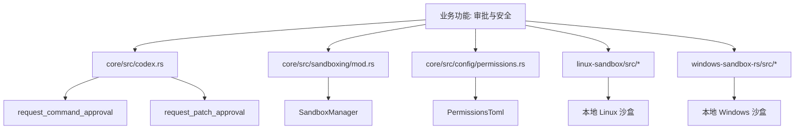
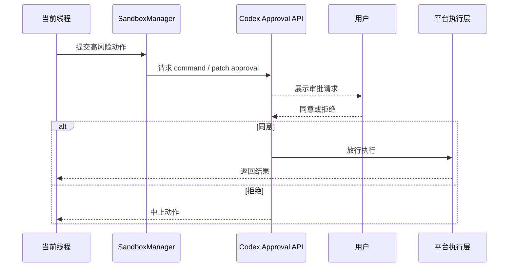

# 第57章 代理批准与安全

> 原始页面：[Agent approvals & security – Codex | OpenAI Developers](https://developers.openai.com/codex/agent-approvals-security)

这一章讲的是边界。Codex 不是纯聊天工具，它会读文件、改文件、跑命令，所以必须先讲清楚它能做到哪里。

只要把“能力”和“权限”分开理解，这类章节就不会难。

## 数学类比
配置像给函数预先设定参数。公式不变，但参数不同，图像和输出会明显不同。

## 严谨定义
严格地说，配置是运行时行为的参数化描述。

## 本章先抓重点
- Codex 帮助保护您的代码和数据，减少误用的风险。
- `沙箱和审批`：Codex 安全控制来自两个协同工作的层次：
- `网络访问 提高风险`：有关 Codex 云，请参见 代理互联网访问 以启用完全互联网访问或域允许列表。

## 正文整理
### 正文
Codex 帮助保护您的代码和数据，减少误用的风险。

继续往下看，这一节还强调了两件事：
- 本页面涵盖了如何安全地操作 Codex，包括沙箱、审批和网络访问。如果您正在寻找用于扫描连接的 GitHub 仓库的 Codex 安全产品，请参见 Codex 安全。（实现：[sandboxing/mod](/config/workspace/codex/codex-rs/core/src/sandboxing/mod.rs:38)、[SandboxManager](/config/workspace/codex/codex-rs/core/src/sandboxing/mod.rs:291)、[config/permissions](/config/workspace/codex/codex-rs/core/src/config/permissions.rs:9)、[linux-sandbox](/config/workspace/codex/codex-rs/linux-sandbox/src/lib.rs:18)）
- 默认情况下，代理在网络访问关闭的情况下运行。在本地，Codex 使用操作系统强制的沙箱，它限制它可以接触的内容（通常是当前工作区），加上一个审批政策，控制何时需要在执行操作之前停止并询问您。（实现：[sandboxing/mod](/config/workspace/codex/codex-rs/core/src/sandboxing/mod.rs:38)、[SandboxManager](/config/workspace/codex/codex-rs/core/src/sandboxing/mod.rs:291)、[config/permissions](/config/workspace/codex/codex-rs/core/src/config/permissions.rs:9)、[linux-sandbox](/config/workspace/codex/codex-rs/linux-sandbox/src/lib.rs:18)）
- 有关沙箱如何在 Codex 应用程序、IDE 扩展和 CLI 中工作的高级解释，请参见 沙箱。有关更广泛的企业安全概述，请参见 Codex 安全白皮书。（实现：[app-server run_main](/config/workspace/codex/codex-rs/app-server/src/lib.rs:295)、[CodexMessageProcessor](/config/workspace/codex/codex-rs/app-server/src/codex_message_processor.rs:399)、[transport](/config/workspace/codex/codex-rs/app-server/src/transport.rs:73)、[thread_state](/config/workspace/codex/codex-rs/app-server/src/thread_state.rs:1)）

### 沙箱和审批
Codex 安全控制来自两个协同工作的层次：

继续往下看，这一节还强调了两件事：
- **沙箱模式**：Codex 在执行模型生成的命令时技术上可以做什么（例如，它可以在哪里写作，是否可以访问网络）。（实现：[ModelsManager](/config/workspace/codex/codex-rs/core/src/models_manager/manager.rs:55)、[model_info](/config/workspace/codex/codex-rs/core/src/models_manager/model_info.rs:1)、[model_presets](/config/workspace/codex/codex-rs/core/src/models_manager/model_presets.rs:1)、[supported_models](/config/workspace/codex/codex-rs/app-server/src/models.rs:10)）
- **审批政策**：当 Codex 执行某个操作时，必须在执行之前询问您（例如，离开沙箱、使用网络或运行不在可信集合中的命令）。（实现：[sandboxing/mod](/config/workspace/codex/codex-rs/core/src/sandboxing/mod.rs:38)、[SandboxManager](/config/workspace/codex/codex-rs/core/src/sandboxing/mod.rs:291)、[config/permissions](/config/workspace/codex/codex-rs/core/src/config/permissions.rs:9)、[linux-sandbox](/config/workspace/codex/codex-rs/linux-sandbox/src/lib.rs:18)）
- Codex 根据您运行它的位置使用不同的沙箱模式：

### 网络访问 提高风险
有关 Codex 云，请参见 代理互联网访问 以启用完全互联网访问或域允许列表。

继续往下看，这一节还强调了两件事：
- 对于 Codex 应用、CLI 或 IDE 扩展，默认的 `workspace-write` 沙箱模式保持网络访问关闭，除非您在配置中启用它：（实现：[sandboxing/mod](/config/workspace/codex/codex-rs/core/src/sandboxing/mod.rs:38)、[SandboxManager](/config/workspace/codex/codex-rs/core/src/sandboxing/mod.rs:291)、[config/permissions](/config/workspace/codex/codex-rs/core/src/config/permissions.rs:9)、[linux-sandbox](/config/workspace/codex/codex-rs/linux-sandbox/src/lib.rs:18)）
- 您还可以在不授予完全网络访问权限的情况下控制 网络搜索工具。Codex 默认使用网络搜索缓存来访问结果。缓存是 OpenAI 维护的网络结果索引，因此缓存模式返回预先索引的结果，而不是提取实时页面。这减少了来自任意实时内容的提示注入的暴露，但您仍应将网络结果视为不可信。如果您使用 `--yolo` …（实现：[sandboxing/mod](/config/workspace/codex/codex-rs/core/src/sandboxing/mod.rs:38)、[SandboxManager](/config/workspace/codex/codex-rs/core/src/sandboxing/mod.rs:291)、[config/permissions](/config/workspace/codex/codex-rs/core/src/config/permissions.rs:9)、[linux-sandbox](/config/workspace/codex/codex-rs/linux-sandbox/src/lib.rs:18)）
- 在 Codex 中启用网络访问或网络搜索时请谨慎。提示注入可能导致代理获取并遵循不可信的指令。（实现：[sandboxing/mod](/config/workspace/codex/codex-rs/core/src/sandboxing/mod.rs:38)、[SandboxManager](/config/workspace/codex/codex-rs/core/src/sandboxing/mod.rs:291)、[config/permissions](/config/workspace/codex/codex-rs/core/src/config/permissions.rs:9)、[linux-sandbox](/config/workspace/codex/codex-rs/linux-sandbox/src/lib.rs:18)）

### 默认值和推荐
启动时，Codex 检测文件夹是否受版本控制，然后建议：

继续往下看，这一节还强调了两件事：
- 受版本控制的文件夹：`Auto`（工作区写入 + 请求时审批）（实现：[sandboxing/mod](/config/workspace/codex/codex-rs/core/src/sandboxing/mod.rs:38)、[SandboxManager](/config/workspace/codex/codex-rs/core/src/sandboxing/mod.rs:291)、[config/permissions](/config/workspace/codex/codex-rs/core/src/config/permissions.rs:9)、[linux-sandbox](/config/workspace/codex/codex-rs/linux-sandbox/src/lib.rs:18)）
- 非版本控制的文件夹：`read-only`（实现：[sandboxing/mod](/config/workspace/codex/codex-rs/core/src/sandboxing/mod.rs:38)、[SandboxManager](/config/workspace/codex/codex-rs/core/src/sandboxing/mod.rs:291)、[config/permissions](/config/workspace/codex/codex-rs/core/src/config/permissions.rs:9)、[linux-sandbox](/config/workspace/codex/codex-rs/linux-sandbox/src/lib.rs:18)）
- 根据您的设置，Codex 也可能在明确信任工作目录之前以 `read-only` 开始（例如，通过入职提示或 `/permissions`）。（实现：[sandboxing/mod](/config/workspace/codex/codex-rs/core/src/sandboxing/mod.rs:38)、[SandboxManager](/config/workspace/codex/codex-rs/core/src/sandboxing/mod.rs:291)、[config/permissions](/config/workspace/codex/codex-rs/core/src/config/permissions.rs:9)、[linux-sandbox](/config/workspace/codex/codex-rs/linux-sandbox/src/lib.rs:18)）

### 可写根中的受保护路径
在默认的 `workspace-write` 沙箱策略中，可写根仍包括受保护路径：（实现：[sandboxing/mod](/config/workspace/codex/codex-rs/core/src/sandboxing/mod.rs:38)、[SandboxManager](/config/workspace/codex/codex-rs/core/src/sandboxing/mod.rs:291)、[config/permissions](/config/workspace/codex/codex-rs/core/src/config/permissions.rs:9)、[linux-sandbox](/config/workspace/codex/codex-rs/linux-sandbox/src/lib.rs:18)）

继续往下看，这一节还强调了两件事：
- `<writable_root>/.git` 不论作为目录还是文件出现，都作为只读受保护。（实现：[git_info](/config/workspace/codex/codex-rs/core/src/git_info.rs:1)、[undo task](/config/workspace/codex/codex-rs/core/src/tasks/undo.rs:1)、[review prompts](/config/workspace/codex/codex-rs/core/src/review_prompts.rs:22)、[commit_attribution](/config/workspace/codex/codex-rs/core/src/commit_attribution.rs:1)）
- 如果 `<writable_root>/.git` 是一个指针文件（`gitdir: ...`），解析后的 Git 目录路径也是只读受保护。（实现：[git_info](/config/workspace/codex/codex-rs/core/src/git_info.rs:1)、[undo task](/config/workspace/codex/codex-rs/core/src/tasks/undo.rs:1)、[review prompts](/config/workspace/codex/codex-rs/core/src/review_prompts.rs:22)、[commit_attribution](/config/workspace/codex/codex-rs/core/src/commit_attribution.rs:1)）
- `<writable_root>/.agents` 在存在为目录时受保护为只读。（实现：[custom_prompts](/config/workspace/codex/codex-rs/core/src/custom_prompts.rs:9)、[project_doc](/config/workspace/codex/codex-rs/core/src/project_doc.rs:134)、[instructions/user_instructions](/config/workspace/codex/codex-rs/core/src/instructions/user_instructions.rs:1)）

## 代码结构图
审批与安全和“沙盒本体”不完全一样，它更强调策略层、审批层、平台执行层之间的联动。

## 实现流程图
这张图对应“一个潜在高风险动作出现后，安全链路如何拦截、询问、再决定是否执行”。

## 小结
读完这一章后，最重要的不是记住页面上的每个术语，而是知道它在整个 Codex 体系里负责解决什么问题。
