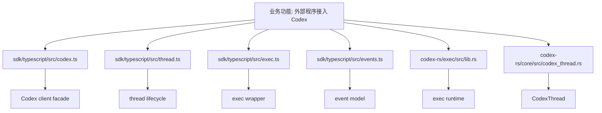
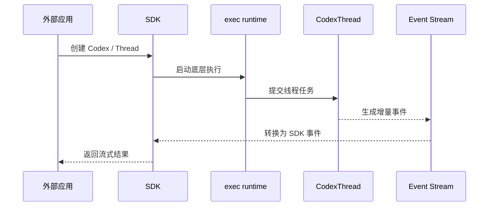

# 第64章 Codex SDK

> 原始页面：[SDK – Codex | OpenAI Developers](https://developers.openai.com/codex/sdk)

这一章主要把官方页面里的内容重新整理成顺着读也能理解的讲解。

阅读时可以先抓住它解决的问题，再看它的操作方式和限制条件。

## 数学类比
把这一章看成在学习一个新的数学对象。先认识它的定义，再看它的性质，最后看它怎么解题。

## 严谨定义
严格地说，这一章讨论的是 Codex 体系中的一个功能模块，以及它与输入、状态、输出之间的关系。

## 本章先抓重点
- 如果你通过 Codex CLI、IDE 扩展或 Codex Web 使用 Codex，你也可以通过编程方式控制它。
- `TypeScript 库`：TypeScript 库提供了一种在应用程序中控制 Codex 的方式，比非交互模式更全面和灵活。
- `安装`：要开始使用，使用 `npm` 安装 Codex SDK：

## 正文整理
### 正文
如果你通过 Codex CLI、IDE 扩展或 Codex Web 使用 Codex，你也可以通过编程方式控制它。（实现：[app-server run_main](/config/workspace/codex/codex-rs/app-server/src/lib.rs:295)、[CodexMessageProcessor](/config/workspace/codex/codex-rs/app-server/src/codex_message_processor.rs:399)、[transport](/config/workspace/codex/codex-rs/app-server/src/transport.rs:73)、[thread_state](/config/workspace/codex/codex-rs/app-server/src/thread_state.rs:1)）

继续往下看，这一节还强调了两件事：
- 当你需要时使用 SDK：
- 将 Codex 作为 CI/CD 流程的一部分进行控制
- 创建自己的代理，可以与 Codex 互动以执行复杂的工程任务

### TypeScript 库
TypeScript 库提供了一种在应用程序中控制 Codex 的方式，比非交互模式更全面和灵活。（实现：[app-server run_main](/config/workspace/codex/codex-rs/app-server/src/lib.rs:295)、[CodexMessageProcessor](/config/workspace/codex/codex-rs/app-server/src/codex_message_processor.rs:399)、[transport](/config/workspace/codex/codex-rs/app-server/src/transport.rs:73)、[thread_state](/config/workspace/codex/codex-rs/app-server/src/thread_state.rs:1)）

继续往下看，这一节还强调了两件事：
- 在服务器端使用该库；它需要 Node.js 18 或更高版本。

### 安装
要开始使用，使用 `npm` 安装 Codex SDK：

### 使用
与 Codex 开始一个线程，并使用你的提示运行它。（实现：[CodexThread](/config/workspace/codex/codex-rs/core/src/codex_thread.rs:37)、[ThreadManager](/config/workspace/codex/codex-rs/core/src/thread_manager.rs:120)、[context_manager](/config/workspace/codex/codex-rs/core/src/context_manager/mod.rs:1)、[message_history](/config/workspace/codex/codex-rs/core/src/message_history.rs:1)）

继续往下看，这一节还强调了两件事：
- const codex = new Codex(); const thread = codex.startThread(); const result = await thread.run( "制定计划以诊断和修复 CI 故障" );
- console.log(result); ```
- 再次调用 `run()` 以继续在同一线程上，或通过提供线程 ID 恢复以前的线程。（实现：[CodexThread](/config/workspace/codex/codex-rs/core/src/codex_thread.rs:37)、[ThreadManager](/config/workspace/codex/codex-rs/core/src/thread_manager.rs:120)、[context_manager](/config/workspace/codex/codex-rs/core/src/context_manager/mod.rs:1)、[message_history](/config/workspace/codex/codex-rs/core/src/message_history.rs:1)）

### Python 库
Python SDK 是实验性的，并通过 JSON-RPC 控制本地 Codex 应用服务器。它需要 Python 3.10 或更高版本和本地的开源 Codex 仓库的检查。（实现：[app-server run_main](/config/workspace/codex/codex-rs/app-server/src/lib.rs:295)、[CodexMessageProcessor](/config/workspace/codex/codex-rs/app-server/src/codex_message_processor.rs:399)、[transport](/config/workspace/codex/codex-rs/app-server/src/transport.rs:73)、[thread_state](/config/workspace/codex/codex-rs/app-server/src/thread_state.rs:1)）

## 代码结构图
SDK 的业务意义是把 Codex 的线程和事件能力暴露给外部程序，因此它的结构天然是“SDK 包装层 + 执行层 + 线程层”。



## 实现流程图
这张图对应“外部应用通过 SDK 发起线程执行，并持续接收事件流”的过程。



## 小结
读完这一章后，最重要的不是记住页面上的每个术语，而是知道它在整个 Codex 体系里负责解决什么问题。
