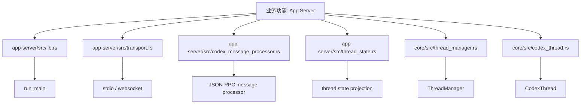
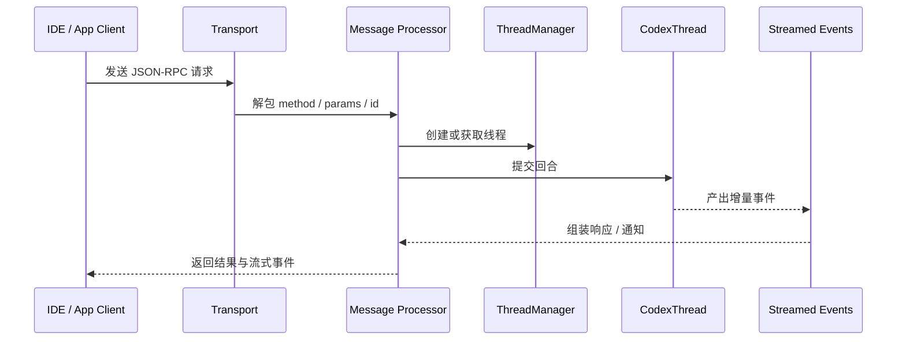

# 第65章 应用服务器

> 原始页面：[App Server – Codex | OpenAI Developers](https://developers.openai.com/codex/app-server)

这一章主要把官方页面里的内容重新整理成顺着读也能理解的讲解。

阅读时可以先抓住它解决的问题，再看它的操作方式和限制条件。

## 数学类比
把自动化看成数列中的递推过程。你先给出初值和递推规则，之后系统会在每个时刻自动算出下一项。

## 严谨定义
严格地说，自动化就是一个由“触发条件 + 指令 + 执行环境 + 输出汇总”组成的重复映射。

## 本章先抓重点
- Codex 应用服务器是 Codex 用于支持丰富客户端的接口（例如，Codex VS Code 扩展）。当您希望将 Codex 深入集成到自己的产品中时，请使用它：身份验证、对话历史、审批和流式代理…
- `协议`：如同 MCP，`codex app-server` 支持使用 JSON-RPC 2.0 消息进行双向通信（在传输中省略了 `"jsonrpc":"2.0"` 头）。
- `消息模式`：请求包括 `method`，`params` 和 `id`：

## 正文整理
### 正文
Codex 应用服务器是 Codex 用于支持丰富客户端的接口（例如，Codex VS Code 扩展）。当您希望将 Codex 深入集成到自己的产品中时，请使用它：身份验证、对话历史、审批和流式代理事件。应用服务器实现是开源的，可以在 Codex GitHub 仓库中找到（ openai/codex/codex-rs/app-server）。有关开源 Co…（实现：[CodexThread](/codex/codex-rs/core/src/codex_thread.rs#L37)、[ThreadManager](/codex/codex-rs/core/src/thread_manager.rs#L120)、[context_manager](/codex/codex-rs/core/src/context_manager/mod.rs#L1)、[message_history](/codex/codex-rs/core/src/message_history.rs#L1)）

继续往下看，这一节还强调了两件事：
- 如果您正在自动化工作或在 CI 中运行 Codex，请使用（实现：[StateRuntime::create_agent_job](/codex/codex-rs/state/src/runtime.rs#L917)、[StateRuntime::report_agent_job_item_result](/codex/codex-rs/state/src/runtime.rs#L1337)、[cloud-tasks App](/codex/codex-rs/cloud-tasks/src/app.rs#L47)、[cloud-tasks CLI](/codex/codex-rs/cloud-tasks/src/cli.rs#L7)）

### 协议
如同 MCP，`codex app-server` 支持使用 JSON-RPC 2.0 消息进行双向通信（在传输中省略了 `"jsonrpc":"2.0"` 头）。（实现：[mcp_connection_manager](/codex/codex-rs/core/src/mcp_connection_manager.rs#L546)、[mcp_tool_call](/codex/codex-rs/core/src/mcp_tool_call.rs#L1)、[core/mcp/mod](/codex/codex-rs/core/src/mcp/mod.rs#L1)、[mcp-server/lib](/codex/codex-rs/mcp-server/src/lib.rs#L51)）

继续往下看，这一节还强调了两件事：
- 支持的传输：
- `stdio` (`--listen stdio://`, 默认)：以换行分隔的 JSON（JSONL）。
- `websocket` (`--listen ws://IP:PORT`, 实验性且不支持)：每个 WebSocket 文本帧一个 JSON-RPC 消息。（实现：[app-server run_main](/codex/codex-rs/app-server/src/lib.rs#L295)、[CodexMessageProcessor](/codex/codex-rs/app-server/src/codex_message_processor.rs#L399)、[transport](/codex/codex-rs/app-server/src/transport.rs#L73)、[thread_state](/codex/codex-rs/app-server/src/thread_state.rs#L1)）

### 消息模式
请求包括 `method`，`params` 和 `id`：

继续往下看，这一节还强调了两件事：
- 响应会以 `id` 附 Echo，带有 `result` 或 `error`：
- 通知省略 `id`，仅使用 `method` 和 `params`：（实现：[Hooks](/codex/codex-rs/hooks/src/registry.rs#L14)、[Hook types](/codex/codex-rs/hooks/src/types.rs#L34)、[user_notification](/codex/codex-rs/hooks/src/user_notification.rs#L31)）
- 您可以从 CLI 生成 TypeScript 模式或 JSON 模式包。每个输出特定于您运行的 Codex 版本，因此生成的工件与该版本完全匹配：（实现：[app-server run_main](/codex/codex-rs/app-server/src/lib.rs#L295)、[CodexMessageProcessor](/codex/codex-rs/app-server/src/codex_message_processor.rs#L399)、[transport](/codex/codex-rs/app-server/src/transport.rs#L73)、[thread_state](/codex/codex-rs/app-server/src/thread_state.rs#L1)）

### 入门
1. 使用 `codex app-server` 启动服务器（默认 stdio 传输）或使用 `codex app-server --listen ws://127.0.0.1:4500`（实验性 WebSocket 传输）。 2. 通过所选传输连接客户端，然后发送 `initialize`，接着是 `initialized` 通知。 3. 启动线程和回合，…（实现：[CodexThread](/codex/codex-rs/core/src/codex_thread.rs#L37)、[ThreadManager](/codex/codex-rs/core/src/thread_manager.rs#L120)、[context_manager](/codex/codex-rs/core/src/context_manager/mod.rs#L1)、[message_history](/codex/codex-rs/core/src/message_history.rs#L1)）

继续往下看，这一节还强调了两件事：
- 示例（Node.js / TypeScript）：
- const proc = spawn("codex", ["app-server"], { stdio: ["pipe", "pipe", "inherit"], }); const rl = readline.createInterface({ input: proc.stdout });（实现：[Codex](/codex/codex-rs/core/src/codex.rs#L285)、[CodexThread](/codex/codex-rs/core/src/codex_thread.rs#L37)、[ThreadManager::fork_thread](/codex/codex-rs/core/src/thread_manager.rs#L375)、[agent/control](/codex/codex-rs/core/src/agent/control.rs#L1)）
- const send = (message: unknown) => { proc.stdin.write(`${JSON.stringify(message)}\n`); };

### 核心原语
**线程**：用户和 Codex 代理之间的对话。线程包含回合。（实现：[CodexThread](/codex/codex-rs/core/src/codex_thread.rs#L37)、[ThreadManager](/codex/codex-rs/core/src/thread_manager.rs#L120)、[context_manager](/codex/codex-rs/core/src/context_manager/mod.rs#L1)、[message_history](/codex/codex-rs/core/src/message_history.rs#L1)）

继续往下看，这一节还强调了两件事：
- **回合**：单个用户请求及随之而来的代理工作。回合包含项目并流式更新。
- **项目**：输入或输出的单位（用户消息、代理消息、命令运行、文件更改、工具调用等）。（实现：[tools/orchestrator](/codex/codex-rs/core/src/tools/orchestrator.rs#L43)、[tools/router](/codex/codex-rs/core/src/tools/router.rs#L1)、[tools/registry](/codex/codex-rs/core/src/tools/registry.rs#L1)、[unified_exec/mod](/codex/codex-rs/core/src/unified_exec/mod.rs#L74)）
- 使用线程 API 创建、列出或归档对话。使用回合 API 驱动对话，并通过回合通知流进度。（实现：[CodexThread](/codex/codex-rs/core/src/codex_thread.rs#L37)、[ThreadManager](/codex/codex-rs/core/src/thread_manager.rs#L120)、[context_manager](/codex/codex-rs/core/src/context_manager/mod.rs#L1)、[message_history](/codex/codex-rs/core/src/message_history.rs#L1)）

## 代码结构图
应用服务器的结构是典型的“传输层 + 消息处理层 + 线程/回合业务层”。

## 实现流程图
这张图对应“客户端通过 app-server 发起一次线程回合，系统如何处理消息、执行线程并回流事件”。

## 小结
读完这一章后，最重要的不是记住页面上的每个术语，而是知道它在整个 Codex 体系里负责解决什么问题。
